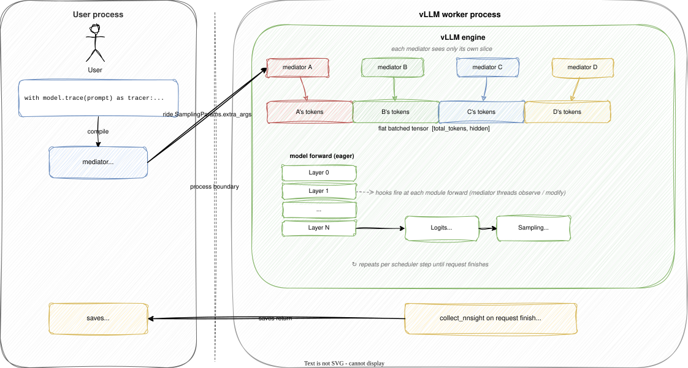
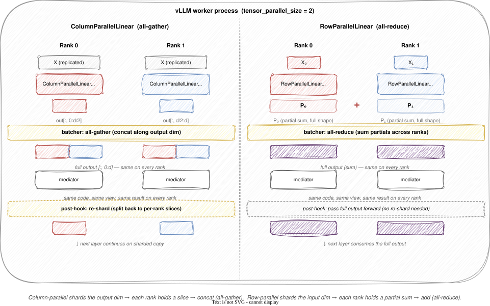

# Blog: NNsight × vLLM (working)

## The problem

There is growing demand for deploying interpretability at production scale: harvesting activations from frontier models for SAE training, steering and probing behavior during live serving, and study internals of models with hundreds of billions of parameters. Hugging Face Transformers is the natural starting point for interpretability work. At modest scale it works fine, but at production workload it falls short: weak support for distributed serving, and missing modern inference optimizations that production workload needs. Production engines like vLLM and SGLang fill both gaps, with distributed worker pools (multi-dimension parallelism, multi-node deployment) and modern inference optimizations (paged KV caches, continuous batching, request scheduling, fused kernels). All of these make interpretability substantially harder than on Transformers: the engine drives the forward pass, a single module's output can be sharded across GPUs and nodes, and the decode hot path runs through optimized implementation like CUDA graphs or compiled code that Python hooks cannot access.

Some recent efforts have addressed specific slices of this. Goodfire [forked SGLang](https://www.goodfire.ai/blog/interpretability-infra-at-frontier-scale) to harvest activations from Kimi K2 Thinking for SAE training, with the fork tuned to that one workflow. UK AISI's [vLLM-Lens](https://github.com/UKGovernmentBEIS/vllm-lens) and IBM's [vLLM-Hook] (https://arxiv.org/abs/2603.06588v1) are vLLM plugins for probes, steering, and activation oracles. While they are compatible with the engine natively, they only cover fixed point interventions, no programmability so researchers are not allowed to define their intervention workflow on-the-fly.

The broader problem is harder than what either slice addresses. Researchers and engineers want to:

- **Observe** activations anywhere in the model, not just the residual stream.
- **Intervene** with arbitrary Python: patching across prompts, zeroing neurons, running a learned probe inline.
- **Compose** multiple interventions in a single forward pass.
- **Iterate** on what they're looking at without spinning up a new pipeline branch.
- **Scale** the work to production-grade inference infrastructure, not a single-GPU notebook.

This is the problem NNsight's vLLM integration is built to solve. The user-facing surface is an in-process illusion:

```python
from nnsight.modeling.vllm import VLLM

model = VLLM("meta-llama/Llama-3.1-70B", tensor_parallel_size=4, dispatch=True)

with model.trace("The Eiffel Tower is in", temperature=0.0):
    h5 = model.model.layers[5].output[0].save()        # observe
    out = model.model.layers[40].output.clone()        # clone (vLLM activations are inference-mode)
    out[0][:] = 0                                       # intervene
    model.model.layers[40].output = out                # write the edit back
    logits = model.logits.save()                       # save final logits
```

While the model is actually served by a highly efficient engine, the user writes the same code they would on a Hugging Face model.

The rest of this post shows how that snippet runs on a production-level model like Kimi K2 across multiple GPUs.

---

## How the integration works

NNsight on Hugging Face Transformers is straightforward. The user wraps the model, and NNsight walks the module tree to build an Envoy mirror, with accessor objects exposing `.output`, `.input`, and `.save()` on each submodule. Inside `with model.trace(prompt):`, those accessors become live hook points. The user's intervention code runs on its own thread, synchronizing against PyTorch forward hooks. When a module fires, `.output` returns the real tensor. Assigning to `.output` swaps the value before the model continues.

vLLM departs from that picture along three axes:

- **Engine-driven execution.** The engine decides when forward runs, when each request enters or leaves the running batch, how decode steps are scheduled, and when to stream a partial result. The interleaver no longer wraps `model(...)`.
- **Distributed execution.** A single module's output can be sharded across GPUs by tensor parallelism or expert parallelism. A single mediator (user-defined intervention function) can spread and interact with modules on different GPUs or nodes. Workers can live in separate processes, or on different machines.
- **Optimized execution.** Many in-flight requests share a single flat tensor for continuous batching. The decode hot path is captured into CUDA graphs or compiled with torch.compile. KVs are paged and cached via complex KV cache machinery. The source of truth for the forward pass is no longer Python code that admits hooks.

Most of the integration handles engine-driven execution. For distributed execution, we cover tensor parallelism today (the batcher gathers and scatters on access); expert and pipeline parallelism are still in design. For optimized execution, the same batcher handles continuous batching by tracking each request's slice through the flat tensor; we sidestep CUDA graphs and the paged KV cache by forcing eager mode and disabling several visibility features, which is the cost of arbitrary intervention against a compiled engine. Python-level structure survives to hook into: `nn.Module` forwards, plus a few explicit runtime values (logits, sampled tokens) that we expose as hookable properties.



### Getting intervention code into vLLM

Before any hook can fire, the mediator has to attach to where the model is. That takes two pieces: it has to cross the process boundary into the worker, and once there it has to address the model.

**Shipping the mediator.** NNsight already has machinery for shipping a compiled mediator across a process boundary. The `remote=True` path uses it to deliver traces to NDIF over its own connection. For vLLM we wanted something different: if the mediator rides vLLM's request pipeline directly, anything vLLM does to a request (batching it, scheduling it, shipping it to a Ray actor) happens to the intervention too. `SamplingParams` already travels from engine to scheduler to worker on every request, and it carries an `extra_args` field meant for forward-compatible metadata. We serialize the mediator into it, along with a trace ID and a few pieces of metadata for cross-invoke coordination. On the worker, the model runner reads the mediator out of `extra_args`, deserializes it, and hands it to the interleaver.

**Wrapping the model.** The other half is making the model itself reachable from both sides. When the user writes `model.model.layers[5].output.save()`, that path has to mean something in two places at once: locally, where the trace is compiled, and remotely, where the hook fires. We keep two `VLLM` wrappers, one in each process. The user-side `VLLM` loads on meta: no weights, no GPU memory, just the module structure that lets the user write `model.model.layers[5]` and have it type-check. The worker-side `VLLM` is created inside the worker, wrapping the real model that vLLM has already loaded. The interleaver attaches to that wrapper.

The two wrappers describe the same module tree. `model.model.layers[5]` resolves locally during tracing and against the real model on the worker. Both halves stay invisible to the user, and the trace looks identical to what they'd write on a Hugging Face model.

### Making vLLM tensors look local

The mediator wants to read `model.layers[5].output` and get the activation for its own trace, at the current step, in its natural shape. vLLM doesn't offer that directly. Execution is split into multiple phases instead of one wrappable call, tokens from many in-flight requests share a flat tensor, and a single trace spans many forward passes rather than just one. The integration hides all of this from the mediator.

**Phases.** The engine splits execution into a per-step sampling pipeline plus a separate collection event, and we open an interleaver context at each insertion point:

1. **Forward.** When `execute_model` runs, module forward hooks fire; mediators observe and modify activations.
2. **Logits.** Inside `sample_tokens`, before sampling proceeds, vLLM hands us the logits tensor; we expose it as `model.logits` so mediators can intercept it.
3. **Sampling.** Inside `_sample`, after token IDs are produced, we expose them as `model.samples` for read or replacement.
4. **Collect.** When a request finishes, saves are pulled back through each mediator. Sync mode returns them in the call's response; async attaches them to the final streamed `RequestOutput`.

Phases 1–3 happen on every scheduler step: `execute_model` runs, then `sample_tokens` calls `_sample`. Phase 4 happens on request completion. The mediator thread persists across all of them, so its program is one continuous trace even as the engine bounces between phases.

**Shape.** The interleaver delivers an activation, but what's in it? vLLM concatenates every in-flight request's scheduled tokens into a single `[total_tokens, hidden]` tensor. Chunked prefill mixes stages freely: the same axis can carry a 200-token prefill chunk from one request alongside one-token decodes from several others already in flight. For each mediator to see only its own slice, we track a *batch group*: a `[start_index, count]` window. The batcher narrows the activation to that window before the user reads `.output`, and places the modified value back when the user writes. Batch groups recompute every scheduler tick to track in-flight requests. After forward, token-level windows collapse to prompt-level (`[start, 1]`), since logits and samples have one row per request rather than per token. This is also why per-prefill-token logits aren't directly available: vLLM only computes `lm_head` on the last token (enough to sample the next one), so logits for earlier prefill positions have to be recomputed manually — reapply the final norm and `lm_head` to the hidden states, inside the trace (vLLM's weights live in the worker, so the call has to run there):

```python
with model.trace(prompt):
    hs = model.model.layers[-1].output[0] + model.model.layers[-1].output[1]  # combine dual residual streams
    normed = model.model.norm(hs)
    if isinstance(normed, tuple):              # fused norm returns (normalized, residual)
        normed = normed[0]
    prefill_logits = model.lm_head(normed).save()   # logits at every prefill position
```

**Steps.** A trace doesn't run through one forward pass. It runs through prefill, then decode after decode, each one a fresh `execute_model` call. Module hooks fire once per pass, so the same `model.model.layers[5].output` line means a different tensor each step. We track which step is firing per mediator. Intervention hooks consult that counter when deciding which forward pass's value to deliver, and the user expresses "run this on each step" through `tracer.iter[:]`:

```python
with model.trace(prompt, max_tokens=5) as tracer:
    hs = list().save()
    for step in tracer.iter[:]:
        hs.append(model.model.layers[-1].output[0])
```

The mediator sees none of this. Module access returns the correct activation in the expected shape for the current step. The phases, the flat batches, and the multi-step iteration stay hidden in the integration layer.

### Preserving NNsight semantics at scale

The trace API has four guarantees: every read returns a whole tensor, parent-scope variables are shared across invokes, saves come back when the context exits, and errors raised inside a trace surface to its caller. At scale, vLLM breaks each of these. Sharding distributes a tensor across GPUs, multi-prompt traces become N independent requests on the engine, async generation outlives the `with` block, and a single bad intervention would crash the engine that's running everyone's requests. Each part needs its own fix.

**Distribution.** Production-scale serving doesn't fit one GPU, and vLLM distributes work several ways: tensor parallelism shards a module's output across GPUs, expert parallelism shards MoE experts, pipeline parallelism splits whole layers across ranks, and multi-node setups push workers across machines. We handle TP and PP today.

With `tensor_parallel_size > 1`, vLLM puts `ColumnParallelLinear` and `RowParallelLinear` layers in the model. Each rank's copy holds only a slice of the full weight and produces only a slice of the output. The batcher gathers, lazily: when a mediator touches a TP layer's value, the batcher runs an all-gather (column-parallel) or all-reduce (row-parallel). Every rank ends up with the same complete tensor, and the mediator runs the same intervention against it on every rank. When the mediator is done, a post-hook splits the tensor back so vLLM resumes on its sharded copy. TP layers that no mediator touches pay nothing. The gather and post-hook run on vLLM's compute stream (each mediator's worker thread inherits it on startup), so they don't race with the forward pass.



Pipeline parallelism is more complex. Each rank only sees a subset of the layers, so a mediator that touches layers on different ranks fails to find them. The naive solution is to ship all of the state variables in a mediator to its next rank, but this would be substantial overhead for large traces, like the workload that harvests activations from many layers. Our key observation is: the mediator on different ranks rarely need cross-rank states to be dereferenced. In this sense, we design a late-materialization mechanism: we wrap all missing layers with a stub that pulls the state from the canonical rank on dereference. The canonical rank is the one that owns the layer, and it is responsible for maintaining the state. The stub on other ranks only holds a reference to the canonical rank, and when the mediator accesses the layer, it fetches the state from the canonical rank. This way, we avoid shipping large states across ranks, and we only pay the cost of fetching when necessary.

**Multi-prompt traces.** vLLM treats every prompt as an independent request: each has its own scheduling, decode lifecycle, and finish condition. NNsight inherits that, with one prompt per invoke and one mediator per request. A multi-prompt trace therefore becomes N independent requests on the worker. If the user defines shared state in the parent scope (say, `out_ids = [list() for _ in prompts].save()` outside the invokes), each mediator arrives with its own deserialized copy. An append in mediator 0 wouldn't show up in mediator 1.

A small graft on arrival fixes that. The first mediator for a given trace becomes the canonical owner of trace-scope variables. Each subsequent mediator's `__globals__` gets the same names rebound by reference to the canonical copy, so every mediator mutates the same Python object. Cleanup has its own timing: vLLM may finish one request long before another has even been scheduled, so shared-save collection waits until every mediator for the trace has both arrived and completed. Per-invoke saves stay request-scoped, while trace-scope saves wait for the whole trace.

**Async streams.** Async generation introduces a different problem: the trace exits before generation finishes, but the user wants tokens as they're produced. vLLM exposes that through `AsyncLLM`, which yields `RequestOutput` objects step by step. The trace context can't drive generation to completion anymore. On exit, `AsyncVLLMBackend` compiles the mediators, submits the request to `AsyncLLM.generate()`, and parks the resulting async generator on itself. The backend is then directly async-iterable, so the user-facing surface flips from synchronous push to asynchronous pull:

```python
import asyncio
from nnsight.modeling.vllm import VLLM


async def main():
    model = VLLM("Qwen/Qwen3-30B-A3B", mode="async", dispatch=True)

    with model.trace("The Eiffel Tower is in", max_tokens=20) as tracer:
        logits = model.logits.save()

    async for output in tracer.backend:
        print(output.outputs[0].text, end="\r", flush=True)
    print()
    print(output.saves)


if __name__ == "__main__":
    asyncio.run(main())
```

`AsyncLLM` spawns the engine core as a child process via `multiprocessing` spawn, so the `if __name__ == "__main__":` guard is required. Each yielded `RequestOutput` carries the cumulative decoded text so far; the final one (with `output.finished == True`) is the only one that carries `output.saves`. The backend's `__aiter__` loop watches the async generator, calls `collect_nnsight` via `collective_rpc` on the finished output to pull saves back, and forwards intermediate outputs unchanged. Saves arrive once at finish, matching the sync semantics. Per-step streaming was prototyped and could return as an opt-in.

**Error isolation.** A bad intervention raises an exception inside the mediator's worker thread. If we let that bubble up, the engine crashes; vLLM's `EngineDeadError` is unrecoverable until the process restarts, and the engine is batching many requests at the time of failure, so one user's bug would take everyone's traces with it. We catch the exception at the interleaver instead and store it on the mediator. When the request's saves are collected, the exception travels back to the caller alongside them, wrapped in a typed envelope that survives serialization. The user's `with model.trace(...)` block re-raises it locally, exactly as it would on a HuggingFace trace. The engine keeps running, and other in-flight traces are unaffected.

Four mechanisms work together to preserve the trace contract at scale. Gather-on-access keeps tensors whole when they're sharded across GPUs. Globals grafting keeps cross-invoke state coherent across many requests. The deferred async backend ensures saves return even when generation outlives the `with` block. Deferred exceptions keep one bad trace from killing the engine. The user writes the same trace code regardless of these scaling dimensions.

---

## Running the engine as a service

So far we've described the integration in local mode: one user dispatching their own engine per session. That works for development, but vLLM's startup (loading weights, initializing the paged KV cache, spawning workers, setting up distributed communication) costs orders of magnitude more than a single forward pass. For a research group iterating against the same model, or a running model service wiring intervention into its inference path, paying that cost on every request is wasteful.

`nnsight-serve` is a single-model FastAPI server backed by vLLM. The CLI mirrors `vllm serve`:

```bash
nnsight-serve Qwen/Qwen3-30B-A3B --port 6677 --tensor-parallel-size 4
```

Trailing flags forward to vLLM's engine. By default the server binds to `127.0.0.1`. It deserializes pickled Python from the request body, which is exactly as dangerous as it sounds. An optional `--api-key` adds header-based auth (the same header NDIF uses, so clients are interchangeable).

The request flow for serve is: read the body, deserialize the trace, compile mediators, spawn one `asyncio.Task` per invoke that calls `engine.generate()` and then `collective_rpc('collect_nnsight')`, gather the results, and `torch.save` the saves into the response. The engine just sees normal vLLM requests with mediator metadata in their `extra_args`, which is the same path described earlier.

For the client, one new kwarg: `serve=url`.

```python
model = VLLM("Qwen/Qwen3-30B-A3B")  # meta-loaded, no GPU

with model.trace("The Eiffel Tower is in", serve="http://localhost:6677"):
    hidden = model.model.layers[24].output[0].save()
    logits = model.logits.save()

print(model.tokenizer.decode(logits.argmax(dim=-1)))  # Paris
```

The blocking call uses the same frame injection local mode does: `.save()`-ed variables appear in the caller's scope when the `with` block exits.

Non-blocking mode lets a single script issue multiple requests in parallel. With `blocking=False`, each `with` block submits the trace through a background thread pool and returns immediately. The same script can fire many traces back-to-back, all in flight on the server at once, and call `.collect()` on each tracer when the saves are needed:

```python
with model.trace("prompt 1", serve=url, blocking=False) as t1:
    out1 = model.logits.save()
with model.trace("prompt 2", serve=url, blocking=False) as t2:
    out2 = model.logits.save()

# Both traces in flight in vLLM's engine; collect when needed.
saves1 = t1.collect()
saves2 = t2.collect()
```

Frame injection doesn't apply in this mode, since the caller's frame has moved on by the time the response arrives. Saves come back as a dict from `.collect()` rather than appearing as locals.

`nnsight-serve` sits between two existing options. Pure local vLLM (what the rest of this post described) has every user dispatch their own engine. NDIF, the National Deep Inference Facility, is the other extreme: a hosted cluster with queueing, multi-tenant routing, and shared models for the research community. `nnsight-serve` is the middle: one model, one persistent server, single-tenant, owned by whoever runs it. For one model and a small team, `nnsight-serve` is the simplest tier. For many models or many tenants, NDIF is closer to what you want.

Installation is `pip install "nnsight[serve]"`, which pulls FastAPI and uvicorn alongside the vLLM dependencies. Editable installs (`pip install -e`) don't register the `nnsight-serve` console script due to a setuptools quirk; fall back to `python -m nnsight.modeling.vllm.serve.cli`.

---

## Remaining gaps and future plans

The integration doesn't cover everything. Some of what's missing is design work we plan to ship; some is structural friction with vLLM's runtime that we sidestepped rather than solved.

**Where intervention semantics diverge from Hugging Face.** vLLM is not Hugging Face Transformers under a different name. We documented several architectural choices showing up as behavioral differences the user has to know about:

- **Fused CUDA kernels.** vLLM replaces many small Python operations with fused C/CUDA kernels: fused normalization (e.g., `fused_add_rms_norm`), fused activations (e.g., `SiluAndMul`), paged attention, and more across releases. Hooks fire on the surrounding module, but the value can be a tuple instead of a tensor, mutate in-place after the hook returns, or expose only a thin Python wrapper to `.source`. We patched the `.save()` method with auto-clone of inference-mode tensors to protect saved tensors from in-place mutations. Writes hit the same inference-mode wall from the other side: an in-place edit (`layer.output[:] = 0`) raises on the worker, so interventions clone the activation, edit the clone, and assign it back (`out = layer.output.clone(); out[0][:] = 0; layer.output = out`) — or replace it outright (`layer.output = new_value`). The rest is documented and patternized.
- **Dual residual stream.** Decoder layers return `(hidden_states, residual)` as separate tensors rather than the combined sum HF returns. The full hidden state is `layer.output[0] + layer.output[1]`, and positional input args (`.input`) are int64 position IDs rather than float activations.
- **Merged linears.** vLLM merges projections that HF keeps separate: attention QKV becomes a single tensor (e.g., `QKVParallelLinear`), MLP gate and up become one (e.g., `MergedColumnParallelLinear`), and similar fusions show up wherever vLLM can amortize a matmul. Per-head or per-projection interventions need `.chunk()` or `.split()` against the merged tensor rather than separate accessors.
- **Flat layout + inference_mode.** The activation shape is `[total_tokens, hidden]` rather than `[batch, seq, hidden]`. Position-based indexing like `[:, -1, :]` becomes `[-1, :]`. vLLM also wraps execution in `torch.inference_mode()`, which blocks gradient-based interventions (integrated gradients, GradCAM, probe training all require a different backend).
- **Prefix caching.** vLLM amortizes work by caching KV for previously-seen sequences. When the next request shares a prefix, those tokens skip the forward pass, and module hooks never fire for them, so an intervention can't read or modify their activations. We disable prefix caching by default (`enable_prefix_caching=False`). 

These are vLLM's design choices that the user inherits, and they make `model.trace` behave slightly differently on vLLM than on Hugging Face. These differences, plus the intervention pattern for each, are documented in the [vLLM model doc](https://github.com/ndif-team/nnsight/blob/main/docs/models/vllm.md).

**What's planned.** Several extensions are in active design:

- **Streaming saves.** Worker-side save collection already separates "collect saves" from "finalize and clean up," so per-step streaming on the async backend is a backend-side change away from working.
- **Multimodal models.** vLLM's vision-encoder disaggregation puts the encoder on separate workers, and interception there needs its own hook point.
- **Partial CUDA graphs.** vLLM V1's piecewise design captures attention separately from MLP, so we could keep graphs on the unhooked segments while running eager only at the layers a trace touches. This is the most likely lever for closing the eager-mode tax.

We are also planning to support other inference engines like SGLang. The mental model for the integration is "hook into the engine's existing request path with a self-contained mediator that carries the user's code and state," which we think can generalize to other engines with similar execution models.

---

## Closing

NNsight's vLLM integration takes a programming model designed for a notebook with one model and one Python process, and runs it against a production-grade inference engine. The integration handles the three places where vLLM departs from a stock transformer: engine-driven execution, distributed execution, and optimized execution. 

Two deployment modes follow. Local dispatch lets researchers run the same `model.trace(...)` code on their own GPUs. `nnsight-serve` lets them run it against a persistent shared engine. Both target the same vLLM machinery production teams already deploy. Install with `pip install "nnsight[vllm]"` for the integration, or `pip install "nnsight[serve]"` for the standalone server.

### Resources

- **Source**: [github.com/ndif-team/nnsight](https://github.com/ndif-team/nnsight)
- **Documentation**: [nnsight.net](https://nnsight.net)
- **NDIF (shared research-community infrastructure)**: project page at [ndif.us](https://ndif.us), interactive workbench at [workbench.ndif.us](https://workbench.ndif.us)
- **Community**: [Discord](https://discord.gg/6uFJmCSwW7)
