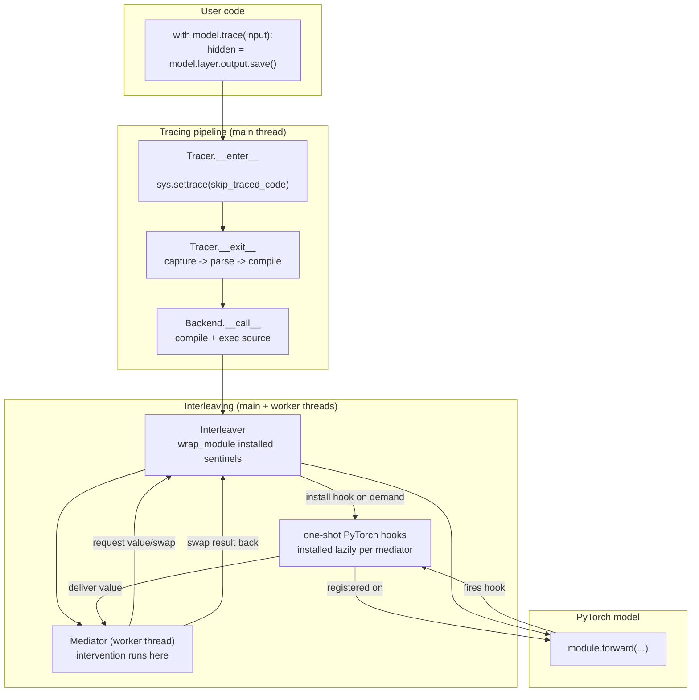

# Architecture Overview

## What this covers

This doc is the top-down map for everything else in `docs/developing/`. It explains the layered subsystems that turn a `with model.trace(...): ...` block into a coordinated execution of intervention code and a real model forward pass. Other docs in this folder dive into individual layers; this one shows how they connect.

The `refactor/transform` branch reorganizes two previously-tangled concerns:

1. **Hook installation moved from "permanent on every module" to "lazy and one-shot per mediator"** — the model is no longer paying the cost of intervention hooks when no intervention is active. See `docs/developing/lazy-hook-system.md`.
2. **Module-level value access was promoted into a formal extension API (`eproperty`)** — `Envoy.output`, `Envoy.input`, `Envoy.inputs`, `OperationEnvoy.*`, `InterleavingTracer.result`, and the vLLM `logits`/`samples` properties are all expressed as the same descriptor. See `docs/developing/eproperty-deep-dive.md`.

Both changes are load-bearing for understanding how a value reaches user code.

## Architecture

### The layers

### Layer-by-layer

#### 1. User code

The user writes a `with` block. The body of that block is *not* executed as ordinary Python; it is captured, compiled, and run later in a worker thread.

#### 2. Tracer (capture + compile)

`Tracer` (`src/nnsight/intervention/tracing/base.py:47`) is the base class for every tracing context (`InterleavingTracer`, `Invoker`, `IteratorTracer`, `ScanningTracer`, `BackwardsTracer`, `EditingTracer`).

- `__enter__` installs a `sys.settrace` callback that intercepts execution as soon as the with-block body is entered, raising `ExitTracingException` to skip the body (`src/nnsight/intervention/tracing/base.py:620`-`660`).
- `__exit__` calls `capture()` (already invoked in `__init__` for some subclasses) and then hands the `Tracer` to the configured `Backend` (`src/nnsight/intervention/tracing/base.py:664`-`698`).
- `capture()` walks the call stack, fetches the source of the user's frame (file, IPython, `python -c`, console, or a parent trace), AST-parses it to find the `with` block, and stores the result in `Tracer.Info` (`src/nnsight/intervention/tracing/base.py:204`-`356`).

A cache key built from `(filename, lineno, function_name, co_firstlineno)` lets repeat traces at the same call site skip source extraction and AST parsing entirely (`src/nnsight/intervention/tracing/base.py:229`-`253`). See `docs/developing/tracing-pipeline.md` for the full sequence.

#### 3. Backend (compile + exec)

`Backend.__call__` (`src/nnsight/intervention/backends/base.py:37`) takes the captured source, calls `tracer.compile()` to add the function signature, compiles the source string to a code object (cached on `Globals.cache.code_cache`), and `exec`s the function definition. The resulting callable is returned to the tracer's `execute()` method.

`ExecutionBackend` (`src/nnsight/intervention/backends/execution.py:13`) wraps `Backend` with `Globals.enter()` / `Globals.exit()` lifecycle and exception reconstruction (`wrap_exception`). Other backends specialize execution: `RemoteBackend` ships the compiled function over the wire, `EditingBackend` rebuilds default mediators on the model, etc.

#### 4. Interleaver (orchestration, main thread)

`Interleaver` (`src/nnsight/intervention/interleaver.py:375`) is one per `Envoy` and persists for the lifetime of the wrapped model. Its job is to:

- Hold the list of `Mediator` objects (one per invoke) for the current trace.
- Hold the `Batcher` so per-mediator batch groups can narrow/swap into the batched input.
- Dispatch `handle()` calls when a value lands (either via a PyTorch hook or via `eproperty.provide`).
- Resolve requester strings to iteration suffixes via `iterate_requester` (`interleaver.py:446`).

`Interleaver.wrap_module` (`interleaver.py:481`) is what makes a PyTorch module participate in nnsight at all. It replaces `module.forward` with a thin wrapper that checks for `__nnsight_skip__` in kwargs and (optionally) routes through a `SourceAccessor`, and registers a single sentinel forward hook that returns the output unchanged. The sentinel exists only to keep PyTorch's hook dispatch path live so that lazily-registered one-shot hooks can fire mid-forward; PyTorch fast-paths zero-hook modules and would otherwise bypass them.

#### 5. Mediator (worker thread, one per invoke)

`Mediator` (`src/nnsight/intervention/interleaver.py:718`) wraps one compiled intervention function. Each `tracer.invoke(...)` call produces a Mediator, which on `start()` launches a worker `Thread` that runs the intervention.

Communication between the main thread and the worker is two `Mediator.Value` slots (`event_queue`, `response_queue`), each holding at most one item:

- The worker enqueues an event (`VALUE`, `SWAP`, `SKIP`, `BARRIER`, `END`, `EXCEPTION`) with a requester string and waits on `response_queue`.
- The main thread, in a forward-pass hook, calls `mediator.handle(provider, value)` which compares provider and requester and either responds (releasing the worker), restores the event for a later provider, or raises an out-of-order error.

See `docs/developing/interleaver-internals.md` for the full event-loop walk.

#### 6. Hooks (PyTorch + operation)

When the worker accesses `model.layer.output`, the `eproperty.__get__` descriptor calls the decorated stub. The stub's pre-setup decorator (`requires_output` from `src/nnsight/intervention/hooks.py:271`) installs a one-shot forward hook on the underlying `torch.nn.Module`. The hook self-removes after firing, calls back into `mediator.handle(...)` with the actual output, and returns whatever the worker decided to swap in.

`add_ordered_hook` (`src/nnsight/intervention/hooks.py:92`) inserts each hook into PyTorch's `_forward_hooks` / `_forward_pre_hooks` dict at a position determined by the requesting mediator's index, so hooks fire in invoke-definition order. Persistent hooks (cache, iteration tracking) use `mediator_idx = float('inf')` to always fire last.

Operation-level access (`model.layer.source.op_0.output`) follows the same pattern but the hooks live on plain Python lists owned by an `OperationAccessor`. See `docs/developing/source-accessor-internals.md`.

#### 7. Envoy + eproperty (the user-facing surface)

`Envoy` (`src/nnsight/intervention/envoy.py:54`) is the proxy users actually touch. It wraps a `torch.nn.Module`, holds a reference to the `Interleaver`, and exposes `.output`, `.input`, `.inputs`, `.source`, `.skip`, etc.

The first three are not normal Python properties — they are `eproperty` descriptors (`src/nnsight/intervention/interleaver.py:60`). Reading or writing an `eproperty` from inside a trace goes through the same `request` / `swap` protocol regardless of whether the value comes from a PyTorch hook (Envoy), an operation hook (OperationEnvoy), a tracer-side push (`InterleavingTracer.result`), or a runtime-side push (`VLLM.logits`, `VLLM.samples`).

That uniformity is the point of the refactor: every "I want a value" or "I want to overwrite a value" goes through `eproperty` plus a `requires_*` decorator. To add a new kind of hookable value, you write a stub method, decorate it, and you are done.

## Key files / classes

- `src/nnsight/intervention/tracing/base.py:47` — `Tracer`. Source capture, AST parse, exec-via-trace-callback.
- `src/nnsight/intervention/tracing/base.py:83` — `Tracer.Info`. The data carrier between capture and execute.
- `src/nnsight/intervention/tracing/tracer.py:269` — `InterleavingTracer`. The main `model.trace()` tracer; subclasses add the model and the batcher.
- `src/nnsight/intervention/tracing/invoker.py:14` — `Invoker`. Per-invoke tracer; produces one mediator.
- `src/nnsight/intervention/tracing/iterator.py:184` — `IteratorTracer`. The `tracer.iter[...]` for-loop driver.
- `src/nnsight/intervention/tracing/backwards.py:81` — `BackwardsTracer`. Standalone gradient session triggered by `tensor.backward()`.
- `src/nnsight/intervention/tracing/editing.py:15` — `EditingTracer`. Captures default mediators onto the envoy.
- `src/nnsight/intervention/backends/base.py:18` — `Backend`. Compile + exec; cached code objects.
- `src/nnsight/intervention/backends/execution.py:13` — `ExecutionBackend`. Wraps `Backend` with `Globals.enter/exit` and exception reconstruction.
- `src/nnsight/intervention/interleaver.py:375` — `Interleaver`. Holds mediators and batcher; `handle()` fan-out; `wrap_module()`.
- `src/nnsight/intervention/interleaver.py:718` — `Mediator`. One worker thread per invoke; event-driven `handle()` loop.
- `src/nnsight/intervention/interleaver.py:60` — `eproperty`. The descriptor for hookable properties.
- `src/nnsight/intervention/hooks.py:92` — `add_ordered_hook`. Mediator-ordered hook insertion into PyTorch dicts.
- `src/nnsight/intervention/hooks.py:154` — `input_hook` / `output_hook`. One-shot PyTorch hook factories.
- `src/nnsight/intervention/hooks.py:271` — `requires_output` / `requires_input`. The decorators that glue eproperty to the hook system.
- `src/nnsight/intervention/source.py:359` — `SourceAccessor`. Per-module injected forward + per-op hook state.
- `src/nnsight/intervention/envoy.py:54` — `Envoy`. The user-facing proxy.

## Lifecycle / sequence

A typical `with model.trace(input): ...` proceeds:

1. `Tracer.__init__` runs in user code; `capture()` walks frames, parses AST, populates `Tracer.Info`.
2. `Tracer.__enter__` installs `sys.settrace` and returns the tracer; the with-block body never executes directly because the trace callback raises `ExitTracingException`.
3. `Tracer.__exit__` is called with `ExitTracingException`; it hands control to `self.backend(self)`.
4. `Backend.__call__` calls `tracer.compile()` (which builds a function signature around the captured source), then `compile()` + `exec()` the resulting source string. The compiled code object is cached.
5. `ExecutionBackend` wraps the call in `Globals.enter()` / `Globals.exit()` and catches exceptions through `wrap_exception`.
6. `tracer.execute(fn)` runs the compiled function, which calls `tracer.invoke(input)` (implicitly when the user passed a positional input to `.trace()`). Each invoker creates a `Mediator` and appends it to `tracer.mediators`.
7. `InterleavingTracer.execute` calls `model.interleave(fn, *args, **kwargs)` (`envoy.py:590`). This enters `with self.interleaver:` which starts every mediator's worker thread.
8. Each mediator's first action is to start running the user's intervention code in the worker. As soon as the worker hits an `eproperty` access, the descriptor fires `requires_*`, which registers a one-shot hook on the target module and then calls `mediator.request(requester)` — blocking the worker.
9. `model.interleave` then calls the model's actual forward function on the main thread. PyTorch fires hooks in dict-insertion order; one of them is the one-shot hook the worker installed, which calls `mediator.handle()` to deliver the value and unblock the worker.
10. The worker may modify the value and `swap()` it back; the swap event is processed inline by `Mediator.handle_swap_event`, which calls `batcher.swap(...)` to update the live tensor.
11. When the intervention finishes, the worker sends `END`. The main thread cleans up via `Mediator.cancel`, `Mediator.remove_hooks`, and `Interleaver.cancel`.
12. `Tracer.__exit__` returns `True`, suppressing `ExitTracingException`. Saved values are now in the user's frame locals via `Tracer.push()`.

For backwards traces (`with tensor.backward(): ...`), step 7 is replaced with a `BackwardsTracer` that patches `torch.Tensor.grad` and runs a separate interleaver session.

## Extension points

Three extension surfaces matter most:

- **A new backend** — subclass `Backend` and override `__call__`. The default does `compile + exec + cache + execute`. Use this for remote execution, simulation, or alternate runtimes. See `docs/developing/adding-a-new-backend.md`.
- **A new runtime** — wrap a non-PyTorch model with a custom `NNsight` subclass and `Batcher`. Use the eproperty `provide` API to push runtime-side values into the interleaver. The vLLM integration is the canonical example. See `docs/developing/adding-a-new-runtime.md`.
- **A new envoy property** — add an `eproperty` to a custom `Envoy` subclass. If the value is delivered by a PyTorch hook, decorate with `requires_output` or `requires_input`. If it is pushed externally, leave the stub bare and call `eproperty.provide(...)` from the runtime side. See `docs/developing/eproperty-deep-dive.md`.

The `Envoy.envoys=` parameter on construction (`envoy.py:80`-`109`) lets you swap in custom Envoy classes for specific module types or path suffixes — useful when you want, for example, every `nn.Linear` to get a custom `output` view that splits the bias term out.

## Related

- `docs/developing/tracing-pipeline.md` — capture, parse, compile, execute in detail.
- `docs/developing/interleaver-internals.md` — the event loop, `iterate_requester`, mediator state.
- `docs/developing/lazy-hook-system.md` — what changed in `refactor/transform` and why the sentinel hook exists.
- `docs/developing/source-accessor-internals.md` — `.source` for in-module operations.
- `docs/developing/eproperty-deep-dive.md` — the descriptor protocol and its decorators.
- `NNsight.md` Sections 2 and 3 — the original design narrative; this doc supersedes it for the lazy-hook architecture.
