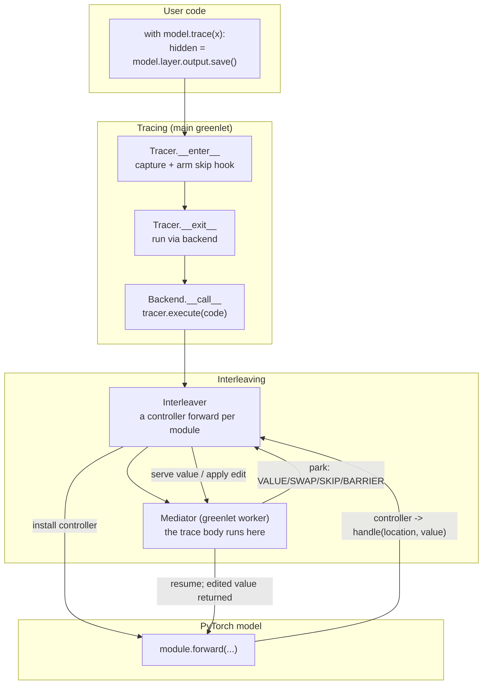

# Architecture Overview

## What this covers

The map for everything else in `docs/developing/`: which layer owns what, and
where to go for each one. It turns a `with model.trace(...): ...` block into a
coordinated execution of intervention code and a real forward pass, and hands off
to the page that covers each layer in depth.

Two facts frame the whole design:

1. **The trace body does not run inline.** It is captured by source, compiled to a
   standalone code object, and executed later — interleaved with the model.
2. **Intervention code runs in a greenlet, not a thread.** A worker and the model
   take strict turns on one thread; there are no locks or queues, only greenlet
   switches.

## The layers

```mermaid
flowchart TB
  subgraph User["User code"]
    U["with model.trace(x):
   hidden = model.layer.output.save()"]
  end

  subgraph Tracing["Tracing (main greenlet)"]
    T1["Tracer.__enter__
   capture + arm skip hook"]
    T2["Tracer.__exit__
   run via backend"]
    T3["Backend.__call__
   tracer.execute(code)"]
  end

  subgraph Interleaving["Interleaving"]
    I1["Interleaver
   a controller forward per module"]
    M1["Mediator (greenlet worker)
   the trace body runs here"]
  end

  subgraph Model["PyTorch model"]
    F["module.forward(...)"]
  end

  U --> T1 --> T2 --> T3 --> I1
  I1 --> M1
  M1 -- "park: VALUE/SWAP/SKIP/BARRIER" --> I1
  I1 -- "install controller" --> F
  F -- "controller -> handle(location, value)" --> I1
  I1 -- "serve value / apply edit" --> M1
  M1 -- "resume; edited value returned" --> F
```

| Layer | Where | Covered by |
|---|---|---|
| **Tracer** — capture the block, compile its body, run it through a backend | `src/nnsight/tracing/tracer.py` | [tracing-pipeline.md](./tracing-pipeline.md) |
| **Backend** — decide what "run the block" means | `src/nnsight/tracing/backend.py`, `src/nnsight/intervention/backends/` | [backends.md](./backends.md) |
| **Interleaver** — own the controllers and the workers; serve a location | `src/nnsight/intervention/interleaver.py` | [interleaver-internals.md](./interleaver-internals.md) |
| **Controller** — the forward installed on every wrapped module | `src/nnsight/intervention/source.py` (`install_controller`) | [controller.md](./controller.md) |
| **Mediator** — one greenlet worker per invoke | `src/nnsight/intervention/interleaver.py` | [interleaver-internals.md](./interleaver-internals.md) |
| **Batcher** — combine invokes; scope each block to its rows | `src/nnsight/intervention/batching.py` | [batching-internals.md](./batching-internals.md) |
| **Envoy** — the proxy users touch | `src/nnsight/intervention/envoy.py` | [extending-envoy.md](./extending-envoy.md) |

The mental-model versions of the same machinery are in `docs/concepts/` —
[deferred-execution.md](../concepts/deferred-execution.md),
[threading-and-mediators.md](../concepts/threading-and-mediators.md),
[interleaver-and-controller.md](../concepts/interleaver-and-controller.md),
[batching-and-invokers.md](../concepts/batching-and-invokers.md).

### The one primitive

Everything above the model reduces to a single call. The interleaver exposes a
**location** — a string like `"model.h.0.output"`, `"model.logits"` or `"result"` —
and `Interleaver.handle(location, value)`, which offers a produced value to every
worker parked on that location and returns whatever they wrote back.

A module's controller calls it three times (input, skip gate, output). A runtime
calls it for an engine value. `.source` calls it for an operation inside a forward.
There is no second mechanism: read every other page in this folder as "what calls
`handle`, and with which location".

### What the Envoy exposes

| Envoy member | Location | How |
|---|---|---|
| `.inputs` / `.input` | `"{path}.input"` | `eproperty` — `Mediator.value` (read), `Mediator.swap` (write) |
| `.output` | `"{path}.output"` | `eproperty` — `Mediator.value` / `Mediator.swap` |
| `.skip(x)` | `"{path}.skip"` | a method: `Mediator.skip` |
| `.source` | one location per operation | a plain property (see [source-internals.md](./source-internals.md)) |
| `tracer.result` | `"result"` | `eproperty` on the tracer |

`.input` / `.inputs` / `.output` / `tracer.result` are `eproperty` descriptors
(`src/nnsight/intervention/eproperty.py`) — a small `property` subclass whose
decorated stub is the read-side preprocess of the value served at
`"{path}.{key}"`. Adding a new one is the extension point described in
[extending-envoy.md](./extending-envoy.md).

## Lifecycle / sequence

A typical `with model.trace("hello") as tracer: hidden = model.layer.output.save()`:

1. `Envoy.trace("hello")` constructs `InterleavingTracer(self, "__call__", "hello")`
   and stores the args.
2. `Tracer.__enter__` → `capture()` reads the source, parses the `with`, compiles
   the body, and arms the skip hook. The body never runs inline.
3. Python reaches the body; the skip hook raises `ExitTracingException`.
4. `Tracer.__exit__` swallows it, bumps the trace-scope depth (`inc()`), and calls
   `self.backend(self)` → `tracer.execute(tracer.info.code)`.
5. `InterleavingTracer.execute` builds the run's `Batcher` and — since
   `trace("hello")` has direct input — makes one `Mediator` for the whole block and
   registers its batch group.
6. `Envoy.interleave(fn, batcher=...)` assembles the batcher into the combined
   input, prepends any registered edits, enters `with self.interleaver:` (which
   starts every worker up to its first park), then runs `fn(*args)` — the forward.
7. Each module's controller calls `interleaver.handle("{path}.output", value)`,
   serving any worker parked there and returning the (possibly edited) value.
8. After the forward returns, `interleave` serves the return value at `"result"`,
   then `check_dangling_mediators()` surfaces any worker still parked on a location
   the model never reached.
9. Back in `execute`, `push_result(frame, mediator.lcls)` writes the block's
   variables back; `__exit__`'s outermost `dec()` filters to just the `.save()`-ed
   values. `hidden` now lives in the caller's frame.

For a backward pass (`with tensor.backward(): ...`), the same interleaver runs
under a `BackwardsTracer` that routes `.grad` reads/writes through it
(`src/nnsight/intervention/backward.py`).

## Extension points

- **A new tracer type.** Subclass `Tracer` (or `InterleavingTracer`) and override
  `execute()` to control how the compiled body runs. `ScanningTracer` (adds a
  fake-tensor mode) and `EditingTracer` (stores the block instead of running it)
  are the two smallest examples.
- **A new backend.** Subclass `Backend` and override `__call__`. Use it to change
  *what is done with the captured block* — remote transport, logging, simulation.
  See [adding-a-new-backend.md](./adding-a-new-backend.md).
- **A new model runtime.** Subclass `Envoy`/`NNsight` and override `_batch_size`
  / `_batch`; set `_batcher_class` if the batch layout is non-standard. The vLLM
  integration is the canonical example. See
  [adding-a-new-runtime.md](./adding-a-new-runtime.md).
- **A new envoy value.** Add an `eproperty` to a custom `Envoy`/model subclass (or
  the tracer) — the decorated stub is the read-side preprocess — and feed its
  location from your driver with the eproperty's `.provide` (which calls
  `interleaver.handle(...)`). See [extending-envoy.md](./extending-envoy.md).

## Related

- [tracing-pipeline.md](./tracing-pipeline.md) — capture, parse, build, compile, execute.
- [interleaver-internals.md](./interleaver-internals.md) — the greenlet park/switch event loop.
- [controller.md](./controller.md) — the per-module controller: the handoff, the skip gate, the source-instrumented body.
- [backends.md](./backends.md) — the backend classes.
