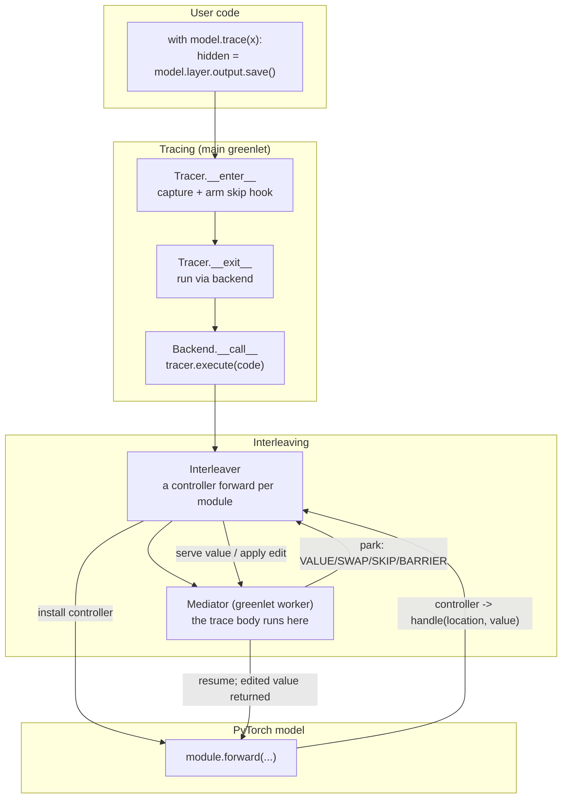

# Architecture Overview

## What this covers

The top-down map for everything else in `docs/developing/`. It explains the layers
that turn a `with model.trace(...): ...` block into a coordinated execution of
intervention code and a real model forward pass. Other docs dive into individual
layers; this one shows how they connect.

Two facts frame the whole design:

1. **The trace body does not run inline.** It is captured by source, compiled to a
   standalone code object, and executed later — interleaved with the model.
2. **Intervention code runs in a greenlet, not a thread.** A worker and the model
   take strict turns on one thread; there are no locks or queues, only greenlet
   switches. Anywhere older docs say "worker thread," read "greenlet worker."

## Architecture

### The layers


```mermaid
flowchart TB
  subgraph User["User code"]
    U["with model.trace(x):
   hidden = model.layer.output.save()"]
  end

  subgraph Tracing["Tracing (main greenlet)"]
    T1["Tracer.__enter__
   capture + arm skip hook"]
    T2["Tracer.__exit__
   run via backend"]
    T3["Backend.__call__
   tracer.execute(code)"]
  end

  subgraph Interleaving["Interleaving"]
    I1["Interleaver
   a controller forward per module"]
    M1["Mediator (greenlet worker)
   the trace body runs here"]
  end

  subgraph Model["PyTorch model"]
    F["module.forward(...)"]
  end

  U --> T1 --> T2 --> T3 --> I1
  I1 --> M1
  M1 -- "park: VALUE/SWAP/SKIP/BARRIER" --> I1
  I1 -- "install controller" --> F
  F -- "controller -> handle(location, value)" --> I1
  I1 -- "serve value / apply edit" --> M1
  M1 -- "resume; edited value returned" --> F
```

### Layer-by-layer

#### 1. User code

The user writes a `with` block. Its body is captured, compiled, and run later in a
greenlet worker — never executed where it stands.

#### 2. Tracer (capture + compile)

`Tracer` (`src/nnsight/tracing/tracer.py:214`) is the base for every tracing
context (`InterleavingTracer`, `Invoker`, `ScanningTracer`, `Iterations`,
`EditingTracer`, and a plain `Tracer` for sessions).

- `__enter__` (`tracer.py:343`) calls `capture()` and, if the block has real code,
  arms a `sys.settrace` hook (`skip_context`, `tracer.py:55`) that raises
  `ExitTracingException` the instant the body would run.
- `capture()` (`tracer.py:270`) looks up the calling frame, reads its source,
  parses the `with` node at that line, and compiles the block *body* into a code
  object. Results are memoized per site in
  `BLOCKS` (`src/nnsight/tracing/globals.py:31`).
- `__exit__` (`tracer.py:449`) swallows `ExitTracingException` and hands control to
  `self.backend(self)`.

There is **no** `Tracer.Info` cache-key/AST-node payload as in older nnsight; the
per-site cache holds `(node, compiled_code)` and `Tracer.Info` carries only the
live frame and the compiled code (`tracer.py:223`).

#### 3. Backend (run the block)

The base `Backend` (`src/nnsight/tracing/backend.py:9`) is a one-liner:

```python
class Backend:
    def __call__(self, tracer):
        tracer.execute(tracer.info.code)
```

The compile work already happened during capture, so a backend just decides what
`execute` means. Subclasses replace execution wholesale: `RemoteBackend` serializes
the trace and ships it to NDIF instead of running it; `LocalSimulationBackend`
serializes/deserializes then runs. There is no `ExecutionBackend` or
`EditingBackend` class — local execution is the default `Backend`, and editing is
handled by `EditingTracer.execute` overriding what happens. See
`docs/developing/backends.md`.

#### 4. Interleaver (the model side)

`Interleaver` (`src/nnsight/intervention/interleaver.py:430`) is one per `Envoy`
tree and persists for the model's lifetime. It:

- Installs a controller as every wrapped module's `forward` (`instrument`,
  `interleaver.py:521`); while a trace is running it hands the module's
  input/output through `handle()`. No PyTorch hooks.
- Holds the list of `Mediator` workers (`mediators`) and the run's `Batcher`.
- On `handle(location, value)` (`interleaver.py:566`) offers the value to every
  worker parked on that location and returns it, edited if a worker wrote to it.
- Passes values straight through when `interleaving` is `False` — an instrumented
  model runs normally outside a trace.

#### 5. Mediator (the greenlet worker)

`Mediator` (`interleaver.py:93`) wraps one captured block and runs it inside a
greenlet. `start()` (`interleaver.py:323`) switches into the greenlet, which runs
until the intervention code asks for a value and *parks*: it names a **location**
and switches back to the parent (the model side). The four park calls:

- `Mediator.value(location)` — read a location (`Event.VALUE`).
- `Mediator.swap(location, value)` — replace it (`Event.SWAP`).
- `Mediator.skip(location, value)` — bypass a gated computation (`Event.SKIP`).
- `Mediator.barrier()` — wait on the other workers (`Event.BARRIER`).

Each mediator holds at most one pending event. Requests must be made in the order
the model reaches the locations; asking for one the model ran past raises
`OutOfOrderError` (`interleaver.py:83`).

#### 6. Envoy (the user-facing surface)

`Envoy` (`src/nnsight/intervention/envoy.py:105`) is the proxy users touch. It
mirrors the module tree and exposes its hookable values over the mediator API:

| Envoy member | delegates to |
|---|---|
| `.inputs` / `.input` | `eproperty` on `"{path}.input"` — `Mediator.value` (read), `Mediator.swap` (write) |
| `.output` | `eproperty` on `"{path}.output"` — `Mediator.value` / `Mediator.swap` |
| `.skip(x)` | `Mediator.skip("{path}.skip", x)` (a method) |
| `.source` | operation-level access, a plain property (see `source-internals.md`) |
| `tracer.result` | `eproperty` on `"result"` |

`.input`/`.inputs`/`.output` (and `tracer.result`) are `eproperty` descriptors
(`intervention/eproperty.py`) — a small `property` subclass whose decorated stub is
the read-side preprocess of the value the interleaver served at
`"{path}.{key}"` (`envoy.py:419`-`455`, `tracer.py:106`). Adding a new hookable
value means adding an `eproperty` to a model/runtime subclass (or the tracer) and
serving it from a driver with its `.provide` (`obj.interleaver.handle(location,
value)`) — exactly how vLLM exposes `.logits`/`.samples`.

## Key files / classes

- `src/nnsight/tracing/tracer.py:214` — `Tracer`. Capture, parse, build, compile,
  execute, `__exit__`-via-backend.
- `src/nnsight/tracing/tracer.py:223` — `Tracer.Info`. Live frame + compiled code.
- `src/nnsight/tracing/backend.py:9` — `Backend`. `tracer.execute(tracer.info.code)`.
- `src/nnsight/tracing/util.py:32` — `Scope`. The namespace a captured block runs in.
- `src/nnsight/intervention/tracer.py:48` — `InterleavingTracer`. The `model.trace()` tracer.
- `src/nnsight/intervention/tracer.py:336` — `Invoker`. One `tracer.invoke(...)` block.
- `src/nnsight/intervention/tracer.py:299` — `ScanningTracer`. Fake-tensor forward.
- `src/nnsight/intervention/interleaver.py:430` — `Interleaver`. Hooks + workers.
- `src/nnsight/intervention/interleaver.py:93` — `Mediator`. One greenlet worker.
- `src/nnsight/intervention/interleaver.py:56` — `Event`. VALUE / SWAP / SKIP / BARRIER.
- `src/nnsight/intervention/envoy.py:105` — `Envoy`. The user-facing proxy.
- `src/nnsight/intervention/envoy.py:612` — `Envoy.interleave`. The low-level driver.
- `src/nnsight/intervention/batching.py:66` — `Batcher`. Per-trace batching.

## Lifecycle / sequence

A typical `with model.trace("hello") as tracer: hidden = model.layer.output.save()`:

1. `Envoy.trace("hello")` constructs `InterleavingTracer(self, "__call__", "hello")`
   and stores the args (`envoy.py:276`, `tracer.py:72`).
2. `Tracer.__enter__` → `capture()` reads the source, parses the `with`, compiles
   the body, and arms the skip hook. The body never runs inline.
3. Python reaches the body; the skip hook raises `ExitTracingException`.
4. `Tracer.__exit__` swallows it, bumps the trace-scope depth (`inc()`), and calls
   `self.backend(self)` → `tracer.execute(tracer.info.code)`.
5. `InterleavingTracer.execute` (`tracer.py:223`) builds a `Batcher` (`self.batcher`),
   and — since `trace("hello")` has direct input — makes one `Mediator` for the whole
   block and registers its batch group.
6. `Envoy.interleave(fn, batcher=self.batcher)` (`envoy.py:612`) assembles the batcher
   into the combined input (and registers it on the interleaver), prepends any
   registered edits, enters `with self.interleaver:` (which starts every worker up to
   its first park), then runs `fn(*args)` — the model's forward.
7. Each module's controller calls `interleaver.handle("{path}.output", value)`,
   serving any worker parked there and returning the (possibly edited) value.
8. After the forward returns, `interleave` serves the return value at `"result"`,
   then `check_dangling_mediators()` surfaces any worker still parked on a location
   the model never reached.
9. Back in `execute`, `push_result(frame, mediator.lcls)` writes the block's
   variables back; `__exit__`'s outermost `dec()` filters to just the `.save()`-ed
   values. `hidden` now lives in the caller's frame.

For a backward pass (`with tensor.backward(): ...`), the same interleaver runs
under a `BackwardsTracer` that routes `.grad` reads/writes through it
(`src/nnsight/intervention/backward.py`).

## Extension points

- **A new tracer type.** Subclass `Tracer` (or `InterleavingTracer`) and override
  `execute()` to control how the compiled body runs. `ScanningTracer` (adds a
  fake-tensor mode) and `EditingTracer` (stores the block instead of running it)
  are the two smallest examples.
- **A new backend.** Subclass `Backend` and override `__call__`. Use it to change
  *what is done with the captured block* — remote transport, logging, simulation.
  See `docs/developing/adding-a-new-backend.md`.
- **A new model runtime.** Subclass `Envoy`/`NNsight` and override `_batch_size`
  / `_batch` (and a `Batcher` subclass if the batch layout is non-standard). The
  vLLM integration is the canonical example.
- **A new envoy value.** Add an `eproperty` to a custom `Envoy`/model subclass (or
  the tracer) — the decorated stub is the read-side preprocess — and feed its
  location from your driver with the eproperty's `.provide` (which calls
  `interleaver.handle(...)`). See `extending-envoy.md`.

## Related

- `docs/developing/tracing-pipeline.md` — capture, parse, build, compile, execute.
- `docs/developing/interleaver-internals.md` — the greenlet park/switch event loop.
- `docs/developing/hook-system.md` — the per-module controller, and when hooks are used instead.
- `docs/developing/backends.md` — the backend classes.
- `docs/concepts/deferred-execution.md`, `docs/concepts/threading-and-mediators.md`
  — the mental-model versions.
