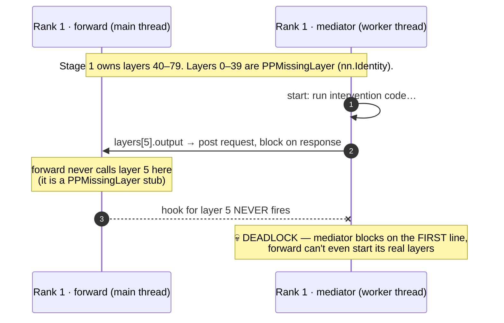
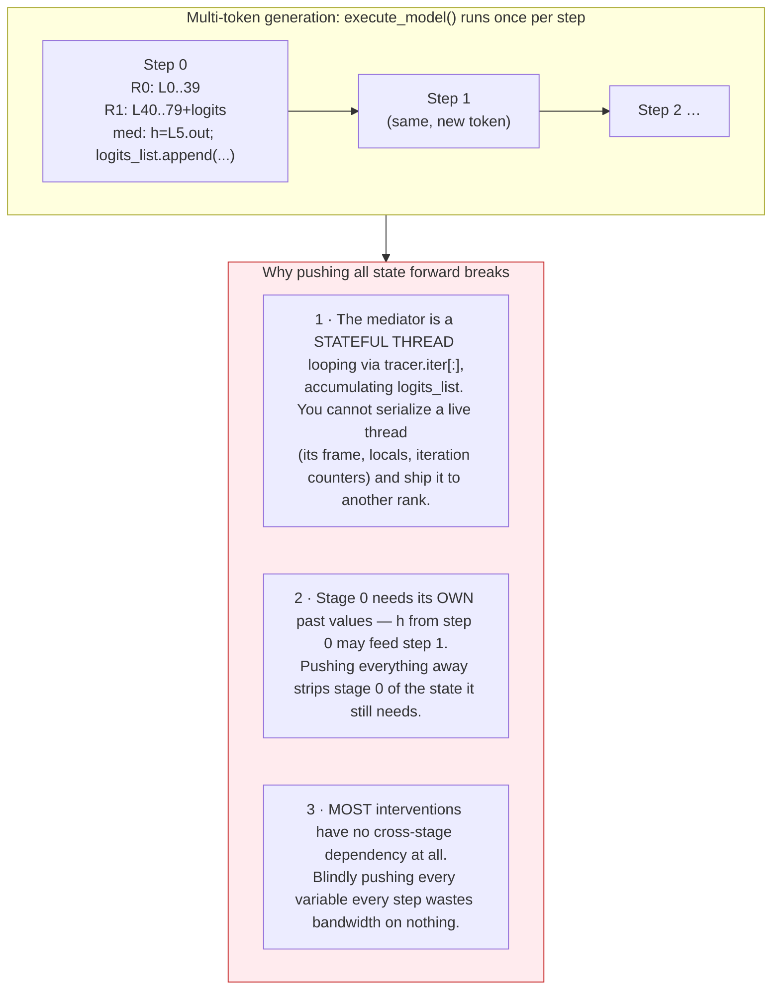
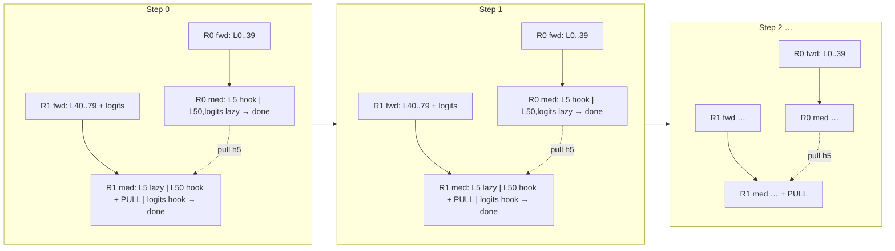

# Pipeline Parallelism in vLLM — An Illustrated Walkthrough

> **Who this is for.** You know roughly how nnsight tracing works (`with model.trace(...)`, `.output`, `.save()`) but you have *never* seen the pipeline-parallel (PP) code and want to understand **why it exists and why it looks the way it does**. No prior knowledge of the PP internals is assumed. We build the problem up from scratch, then show the design that solves it, and trace one concrete example end-to-end.
>
> The detailed engineer-facing spec lives in [`pp-design.md`](pp-design.md). This page is the gentle, picture-first version. The two diagrams below are reproduced inline as Mermaid; the original hand-drawn sources are [`figures/pp-problem.drawio`](figures/pp-problem.drawio) and [`figures/pp-solution.drawio`](figures/pp-solution.drawio) (open in [draw.io](https://app.diagrams.net)).

---

## 1. The promise: write single-GPU code, run on a split model

Pipeline parallelism splits a model **by layer across GPUs (or whole machines)**. An 80-layer model with `pipeline_parallel_size=2` puts layers 0–39 on stage 0 and layers 40–79 on stage 1. A 405B model that cannot fit on one node now fits across two.

The whole point of the nnsight PP design is that **the user never has to know any of this happened.** This is the running example we will follow for the rest of the page:

```python
model = VLLM("meta-llama/Llama-3.1-405B", tensor_parallel_size=8, pipeline_parallel_size=2)

with model.trace("Hello"):
    hidden_5 = model.layers[5].output[0]            # lives on stage 0
    model.layers[50].output[0][:] = hidden_5 * 2    # lives on stage 1 — reads a stage-0 value!
    logits = model.logits.output.save()             # lives on stage 1 (last stage)
```

Read that middle line carefully. It captures a hidden state from **layer 5 (stage 0)** and writes a scaled copy into **layer 50 (stage 1)**. That is a *cross-stage data dependency* expressed in one innocent line of Python. There is no `if pp_rank == 0:` guard. There is no "send this tensor to the other GPU" call. The user wrote exactly what they would write on a single GPU.

Making that line work — transparently, including in multi-token generation — is the entire engineering problem. The rest of this page is about why it is hard and how the design earns that simplicity.

---

## 2. The setup that makes it hard

Two facts about how nnsight and vLLM each work collide badly under PP.

**Fact A — nnsight runs your code as a blocking worker thread.** When you write a trace, nnsight compiles your intervention body into a function and runs it on a *worker thread* called the **mediator** (see [threading-and-mediators](../concepts/threading-and-mediators.md)). When that thread hits `model.layers[5].output`, it does not magically have the value — it **posts a request and blocks**, waiting for the model's forward pass (on the main thread) to reach layer 5, fire a hook, and hand the value back. Access a module → block until its hook fires. That is the core contract.

**Fact B — vLLM materializes the *whole* model on *every* rank, but only half of it is real.** With PP=2, vLLM's `make_layers()` builds all 80 layer slots on both ranks. On stage 0, layers 0–39 are real modules and 40–79 are `PPMissingLayer` — a subclass of `nn.Identity` that is **never called during the forward pass**. On stage 1 it's the mirror image:

```
Stage 0 (rank 0)                         Stage 1 (rank 1)
model.layers = [                         model.layers = [
  [0..39]:  RealLayer                      [0..39]:  PPMissingLayer   ← stubs
  [40..79]: PPMissingLayer  ← stubs        [40..79]: RealLayer
]                                        ]
embed_tokens = Real, norm = Missing      embed_tokens = Missing, norm/logits = Real
```

Now combine them. The **same intervention code** is shipped to and run on **both** ranks (the mediator is deserialized identically everywhere). On stage 1, the very first line `model.layers[5].output` touches a module that is a `PPMissingLayer`. Its forward is never called, so **its hook never fires**. By Fact A, the mediator posts its request and blocks — forever.

### Figure 1 — the basic deadlock

> Reproduces part 1 of [`figures/pp-problem.drawio`](figures/pp-problem.drawio).



The symptom we chased for weeks: a PP trace that simply hangs (~550s timeouts), with no error.

### Why the "obvious fix" also fails

The first instinct is: *"Just push all the intervention state forward to whichever rank owns each module."* Compute what you can on stage 0, ship the variables to stage 1, finish there.

This collapses the moment you look at **multi-token generation**, where vLLM calls `execute_model()` once *per token* and the mediator is a long-lived loop (`for step in tracer.iter[:]`):

### Figure 2 — why "push all state forward" fails

> Reproduces part 2 of [`figures/pp-problem.drawio`](figures/pp-problem.drawio).



So we need something that (a) never blocks on a module that lives on another stage, (b) keeps each rank's mediator alive and stateful across tokens, and (c) only moves data across the wire when a value is *actually* needed on another stage.

---

## 3. The design: short-circuit at the Envoy, pull lazily

The key realization: **the deadlock happens because the mediator blocks *before* anyone notices the module is remote.** If we can detect "this module is a `PPMissingLayer`" at the moment of access — *before* the blocking request is posted — we can hand back a placeholder instantly and let the thread keep running.

That placeholder is a **`LazyRemoteTensor`**. Three pieces make it work:

1. **Short-circuit in the Envoy.** When `.output`/`.input` is accessed on a PPMissing module, the Envoy does **not** post a request to the forward pass. It returns a `LazyRemoteTensor` immediately, carrying only metadata (which rank owns the real value, the provider key, shape/dtype). The mediator never blocks here. ([`pp_envoy.py`](../../src/nnsight/modeling/vllm/pp_envoy.py))

2. **`LazyRemoteTensor` is lazy.** Writes and saves to it are **no-ops** (the value lives on another rank — your write only matters there, and that rank does its own write). It only reaches across the wire and **materializes** when the value is genuinely *consumed* in computation — e.g. `lazy * 2`. ([`lazy_remote_tensor.py`](../../src/nnsight/modeling/vllm/lazy_remote_tensor.py))

3. **A background listener serves pulls.** Each rank clones the hook values it produces into a `pp_hook_buffer` and runs a background **gloo listener thread** that answers "give me provider X" requests from other ranks' `LazyRemoteTensor` materializations. ([`pp_listener.py`](../../src/nnsight/modeling/vllm/pp_listener.py))

### What `LazyRemoteTensor` does, by operation

| Operation                         | Behavior                                  | Crosses the wire? |
|-----------------------------------|-------------------------------------------|:---:|
| `lazy[:] = X`                     | `__setitem__` → no-op                     | No  |
| `lazy[0][:] = X`                  | `__getitem__` → self, then no-op write    | No  |
| `lazy.save()`                     | no-op (owning rank saves the real value)  | No  |
| `lazy.shape` / `.dtype` / `.device` | return cached metadata                  | No  |
| `lazy * 2`, `torch.cat([lazy, x])`, `for row in lazy` | materialize → **gloo pull** | **Yes** |

> The `__iter__`/`__len__` cases are easy to miss: before they were added, `tuple(lazy)` or unpacking a lazy fell back to Python's sequence protocol over `__getitem__` (which returns `self`) and spun forever. Iterating a lazy now materializes it, like any other real consumption (`lazy_remote_tensor.py:133`).

### Figure 3 — short-circuit (stage 0) and lazy pull (stage 1)

> Reproduces parts 1–2 of [`figures/pp-solution.drawio`](figures/pp-solution.drawio), for our running example on a single forward pass.

```mermaid
sequenceDiagram
    autonumber
    participant M0 as R0 forward
    participant W0 as R0 mediator
    participant W1 as R1 mediator
    participant M1 as R1 forward

    Note over M0,M1: layers[5] is real on R0; layers[50] & logits are real on R1.

    rect rgb(232,245,233)
    Note over W0,M0: Stage 0 (rank 0)
    W0->>M0: layers[5].output → real layer, post request & block
    M0-->>W0: L5 hook fires → hand back hidden_5
    W0->>W0: layers[50].output → PPMissing → LazyRemoteTensor (instant, no block)
    W0->>W0: hidden_5 * 2 written into lazy → no-op (absorbed)
    W0->>W0: logits → PPMissing → Lazy → .save() no-op → END
    Note over W0,M0: frame locals + pp_hook_buffer keep hidden_5 alive,<br/>ready to be pulled by rank 1
    end

    rect rgb(227,242,253)
    Note over W1,M1: Stage 1 (rank 1) — same code, different real layers
    W1->>W1: layers[5].output → PPMissing → LazyRemoteTensor (instant)
    W1->>M1: layers[50].output → real layer, post request & block
    M1-->>W1: L50 hook fires → hand back layer-50 output
    W1->>W0: hidden_5 * 2 forces materialize → gloo PULL of hidden_5 from R0
    W0-->>W1: serve hidden_5 from pp_hook_buffer
    W1->>W1: write (hidden_5*2) into layer-50 output (real, takes effect here)
    W1->>M1: logits.output → real → post request, hook fires, .save() keeps it
    end

    Note over W0,M1: collect_nnsight merges saved values from ALL ranks (rank-1's logits wins)
```

Read it against the deadlock figure. The *exact same line* that hung in Figure 1 (`model.layers[5].output` on stage 1) now returns instantly because the Envoy recognizes the stub and hands back a lazy. The mediator sails past every remote module and only parks at the **one real module it owns** (layer 50). The cross-stage value moves **once**, **only because** `hidden_5 * 2` actually reads it — pulled on demand, from stage 0's buffer, over a dedicated gloo group.

### The key win: free-running mediators

Because PPMissing accesses don't block, a rank's mediator can **race ahead through all the remote layers while the other rank is still computing**. By the time stage 1's forward pass is ready to fire hooks, its mediator has already skipped layers 0–39, issued its pull, and parked exactly at layer 40 — the first module it actually owns. There is no serialized drain of 40 sequential RPCs; the remote work overlaps with the other rank's compute.

A small **readiness check** guards the hand-off: before firing forward-pass hooks, the interleaver waits until each mediator has parked at a *local* module access (a pending request in its queue). Since PPMissing accesses never post to that queue, anything sitting in it is guaranteed to be a real, local module — safe to fire.

### Figure 4 — multi-token generation: both mediators stay alive, pull per step

> Reproduces part 3 of [`figures/pp-solution.drawio`](figures/pp-solution.drawio).



This is the part that the "push everything forward" approach could never do. **Both mediators are long-lived threads** iterating via `tracer.iter[:]`; their frame locals (`hidden_5`, an accumulating `logits_list`, loop counters) persist on each rank across every token. There is nothing to serialize and ship. Each step, stage 0 re-captures a *fresh* `hidden_5`; stage 1 pulls that fresh value lazily the moment `hidden_5 * 2` is evaluated. No thread migration, no push-all, no wasted bandwidth on steps with no cross-stage read.

---

## 4. Tracing the running example end-to-end

Putting it together for `model.layers[50].output[0][:] = model.layers[5].output[0] * 2`, single forward pass:

| Step | Rank 0 (owns L5) | Rank 1 (owns L50, logits) |
|---|---|---|
| Access `layers[5].output` | real → block → L5 hook fires → real tensor; **clone into `pp_hook_buffer`** | PPMissing → `LazyRemoteTensor` (instant) |
| Compute `... * 2` | works on the real tensor locally | forces **materialize** → gloo pull of L5 from rank 0's buffer, then `* 2` |
| Write into `layers[50].output[0]` | PPMissing → no-op (not this rank's module) | real → write takes effect during the forward pass |
| `logits.output.save()` | PPMissing → lazy → `.save()` no-op | real → hook fires → value saved |
| Finish | contributes its (empty here) saves | contributes the saved `logits` |
| `collect_nnsight` | merge `{**rank0_saves, **rank1_saves}` — owning rank wins for duplicates |

The user gets back exactly the `logits` they saved, reflecting the steering they wrote, with no idea any of this crossed a stage boundary.

---

## 5. The moving parts (and where they live)

| Component | Role | Source |
|---|---|---|
| **PPMissing short-circuit** | At `.output`/`.input` access, detect `PPMissingLayer` and return a `LazyRemoteTensor` *before* blocking. Also advances the per-module iteration counter so keys stay in sync with the local path. | [`pp_envoy.py`](../../src/nnsight/modeling/vllm/pp_envoy.py) |
| **`LazyRemoteTensor`** | Metadata-only proxy. Absorbs writes/saves as no-ops; materializes (pulls) on real arithmetic, indexing-consume, or iteration. | [`lazy_remote_tensor.py`](../../src/nnsight/modeling/vllm/lazy_remote_tensor.py) |
| **`pp_hook_buffer`** | Per-rank dict `provider.iN → cloned tensor`. Cloned because the live forward tensor gets overwritten by later layers. Serves the listener; cleared at request finish. | runner / `handle_value_event` |
| **`PPListener`** | Background thread per rank. Dedicated **gloo** process group, tag-separated request/response. Waits on a `threading.Condition` if the value isn't buffered yet (handles "pulled before produced"). | [`pp_listener.py`](../../src/nnsight/modeling/vllm/pp_listener.py) |
| **PP readiness check** | Before firing hooks, wait until each mediator parks at a *local* module access. PPMissing never enqueues, so a queued request is provably local. | interleaver entry |
| **`PPModuleMap`** | Maps every module path → owning stage. Layers via `get_pp_indices(...)`; `embed_tokens`→first stage, `norm`/`lm_head`/`logits`→last stage. Built once at load. | [`pp.py`](../../src/nnsight/modeling/vllm/pp.py) |
| **Save collection** | `collect_nnsight` via `collective_rpc` gathers saves from **all** ranks and merges; unmaterialized lazies are filtered as a safety net. | runner |

---

## 6. Why each choice is forced (the one-line justifications)

- **Short-circuit at the Envoy, not deeper** — because the deadlock is a *block before detection*. The only place to avoid the block is the access site, before the request is posted.
- **Lazy, not eager transfer** — most interventions never read across stages; a write/save to a remote module is a no-op. Transferring eagerly would burn bandwidth every step for values nobody consumes (Figure 2, reason 3).
- **Pull, not push** — the consumer knows *when* it needs the value (at materialization); the producer doesn't. Pull-on-demand keeps each rank's stateful mediator intact (Figure 2, reasons 1–2).
- **Clone into the buffer** — the raw hook tensor is part of the live forward graph and gets overwritten by later layers; the listener needs a value that survives independently.
- **Dedicated gloo group + tag separation** — the listener thread and the main thread both touch the network; a separate group with request/response tags prevents two threads doing a concurrent recv on the same channel.

---

## 7. Limitations / open edges

- **PP + TP**: the TP-rank-0 of each PP stage handles pulls; validated on the multinode Ray sweep but worth keeping an eye on for unusual TP layouts.
- **Buffer growth**: `pp_hook_buffer` accumulates per `provider.iN` across tokens. Fine for decode (small tensors); very long generations may eventually want eviction.
- **Cost**: multinode (cross-machine) PP is latency-bound — the cross-stage hop dominates. In a same-host Docker sweep, multinode ran ~1.9–2.1× slower than single-node; nnsight's pull path adds little on top of vLLM's own PP transfer.

---

## See also

- [`pp-design.md`](pp-design.md) — the full engineer-facing spec (components as built, timelines, finalize/drain barrier, non-determinism).
- [vLLM Integration Internals](vllm-integration.md) — the broader vLLM↔nnsight machinery this builds on.
- [Threading and Mediators](../concepts/threading-and-mediators.md) · [Interleaver and Hooks](../concepts/interleaver-and-hooks.md) — the single-GPU model that PP extends.
- Figure sources: [`figures/pp-problem.drawio`](figures/pp-problem.drawio) · [`figures/pp-solution.drawio`](figures/pp-solution.drawio)
