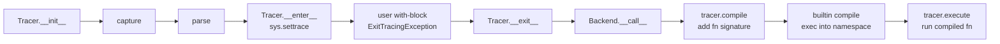

# Tracing Pipeline

## What this covers

The pipeline that turns user code inside a `with model.trace(...): ...` block into a function the interleaver can run in a worker thread. Four steps:

1. **Capture** — find the user's source code via `inspect` or AST.
2. **Parse** — locate the with-block body and trim indentation.
3. **Compile** — wrap the body in a function signature; compile to a code object.
4. **Execute** — run the compiled function in the proper context, then start the interleaver.

This doc covers the base `Tracer` plus the subclass-specific behavior of `InterleavingTracer`, `Invoker`, `IteratorTracer`, `ScanningTracer`, `BackwardsTracer`, and `EditingTracer`. The cache key and `Globals.cache` are central — without them, every trace would re-pay AST parsing and compilation cost.

## Architecture

### The four-step pipeline



Steps A–C run on `Tracer.__enter__` — the tracer is constructed earlier when the user wrote `model.trace(...)`, but capture only fires when the `with` statement actually enters. The two direct callers of `Tracer.capture()` outside `__enter__` are the `Tensor.backward` patcher (`src/nnsight/__init__.py`) and the speculative-trace fallback in `Envoy.__getattr__` (`src/nnsight/intervention/envoy.py`); both call `tracer.capture()` with no frame argument and let `capture` walk the stack via `get_non_nnsight_frame`.

### Tracer.Info

`Tracer.Info` (`src/nnsight/intervention/tracing/base.py:83`) is the data carrier between the four steps. It holds:

- `source: List[str]` — the raw source lines, mutated by `compile()` to add the function signature.
- `frame: FrameType` — the user's calling frame, kept as a reference (not a copy) so `push()` and `pull()` can sync variables.
- `start_line: int` — the line within `source` where the with-block body starts; used by `Tracer.__enter__`'s trace callback to detect when execution has reached the captured code.
- `node: ast.With` — the parsed AST node for the with-statement; used to inspect optional vars (`as tracer:`) and the context expression.
- `filename: str` — either the user's real filename or `<nnsight {abs(cache_key)}>` for compiled-only contexts.
- `cache_key: int` — `hash((co_filename, lineno, co_name, co_firstlineno))` of the calling frame; the lookup key into `Globals.cache`.

`Info` is `__getstate__`/`__setstate__`-friendly: `node` is dropped on serialization (AST nodes do not pickle) and reconstructed from the source string on the remote side if needed.

### The cache key

`capture()` builds the cache key at `src/nnsight/intervention/tracing/base.py:229`-`236`:

```python
cache_key = hash((
    frame.f_code.co_filename,
    start_line,            # f_lineno where the trace was instantiated
    frame.f_code.co_name,
    frame.f_code.co_firstlineno,
))
```

Notes:

- It includes the caller function's `co_firstlineno`, so the same line number in two different functions in the same file gets distinct keys.
- It is not perfectly unique — collisions are possible if two distinct sources happen to hash equal — but in practice the four-tuple is sharp enough.
- The same key is used to look up source/AST and (in `Backend.__call__`) the compiled code object. The code cache is keyed by `(cache_key, type(tracer).__name__)` because different tracer types produce different function bodies; see `src/nnsight/intervention/backends/base.py:64`-`68`.

### Globals.cache

`TracingCache` (`src/nnsight/intervention/tracing/globals.py:53`) holds two dicts:

- `cache` — `cache_key -> (source_lines, start_line, node, filename)`. Populated by `Tracer.capture()` after the AST parse; consumed on the next call from the same site.
- `code_cache` — `(cache_key, tracer_type) -> code object`. Populated by `Backend.__call__` after the first `compile()`.

`Globals.cache.clear()` flushes both. The `TRACE_CACHING` config flag mentioned in older versions is deprecated — caching is unconditional in `refactor/transform`.

`Globals.stack` and `Globals.saves` are unrelated to the trace cache; they track nested-trace depth and the set of objects whose ids should survive `tracer.push()` filtering. See `docs/developing/eproperty-deep-dive.md` for how `nnsight.save()` populates `Globals.saves`.

### Finding the user's frame

Capture needs the frame whose source code contains the user's `with model.trace(...)` line. Two helpers in `src/nnsight/intervention/tracing/util.py` cover the two call shapes:

- **`get_entered_frame()`** — used by `Tracer.__enter__`. `inspect.currentframe().f_back` is normally the user's frame, but ``__enter__`` may be called from inside another `__enter__` — either a subclass calling `super().__enter__()` (e.g. `EditingTracer`) or a user-defined context-manager wrapper class whose `__enter__` opens the inner `with` block. The helper walks past every `co_name == "__enter__"` ancestor and returns the first non-`__enter__` frame above. The wrapping behavior means class-based CM wrappers around `model.trace()` / `model.session()` no longer hang on capture (they fail with a clear "outside of interleaving" error from the value access instead — same root cause but observable at the user's site rather than in nnsight's worker thread).

- **`get_non_nnsight_frame()`** — used as the fallback inside `capture(frame=None)` and by the two direct-capture call sites mentioned above. Walks the stack until the next frame's `__name__` is not `nnsight` or a `nnsight.<sub>` submodule. This replaces the older path-substring heuristic that broke when the user's environment directory was named `nnsight` (#606).

`capture(frame=...)` accepts an explicit frame so unusual call sites (or a custom context-manager wrapper that wants to point the parser at a specific outer frame) can override the auto-walk.

### Source extraction (capture step)

`Tracer.capture()` (`src/nnsight/intervention/tracing/base.py:204`-`356`) handles four contexts, in this priority order:

1. **Cache hit** — return immediately if `Globals.cache.get(cache_key)` returns a tuple.
2. **Nested trace** — if the calling frame has `__nnsight_tracing_info__` in `f_locals`, read the parent's `source` field (this is how `Invoker` reuses the parent `InterleavingTracer`'s already-captured source).
3. **IPython** — if `_ih` is in `f_locals`, fetch the most recent cell from `IPython.get_ipython().user_global_ns["_ih"][-1]`.
4. **Regular file** — call `inspect.getsourcelines(frame)`. This is wrapped in `Patcher([Patch(linecache, noop, "checkcache")])` to prevent `linecache` from re-reading the file mid-trace if the user has saved an edited version (`base.py:283`-`287`).
5. **Command line** — if `inspect.getsourcelines` fails and `-c` is in `sys.orig_argv`, parse the `-c` argument as the source.
6. **Interactive console** — if the calling frame's filename is `<nnsight-console>`, read from `nnsight.__INTERACTIVE_CONSOLE__.buffer`.

Cases 4–6 are deliberately ordered last because they are slower or more brittle. Once source lines are obtained, leading indentation is normalized so the AST parser gets a well-formed module.

### Parse (find the with-block body)

`Tracer.parse()` (`src/nnsight/intervention/tracing/base.py:358`-`439`) AST-parses the normalized source and runs a `WithBlockVisitor` to find the `ast.With` (or `ast.AsyncWith`) node whose context expression is on `start_line`. From the matched node it extracts:

- `body_start_line = visitor.target.body[0].lineno - 1` — the first line of the body.
- `end_line = visitor.target.end_lineno` — the last line of the body.
- The slice `source_lines[body_start_line:end_line]` — the trimmed body lines.

If no node matches, `WithBlockNotFoundError` is raised with five lines of context around the suspect line. This typically means the source the parser is looking at is not the source the user actually wrote — usually a stale cache or an IPython cell that was redefined in flight.

After parsing, the body's leading indentation is stripped a second time (the body itself may be inside a function or class, adding more indent on top of the file-level indent that was already stripped).

### Compile (wrap in a function definition)

Subclasses override `compile()` to produce different function signatures; the base implementation is a fallback that no subclass currently uses. The branches that matter:

- **`InterleavingTracer.compile`** (`src/nnsight/intervention/tracing/tracer.py:335`) wraps the body in:

  ```
  def __nnsight_tracer_<key>__(__nnsight_tracing_info__, <tracer_var_name>):
      <tracer_var_name>.pull()
      ... user body ...
      <tracer_var_name>.get_frame()
  ```

  `<tracer_var_name>` is whatever the user wrote in `as tracer:` (defaulting to `__nnsight_tracer__`). If the user passed real input to `.trace(...)`, an implicit `Invoker` is constructed and the body becomes a single line: `tracer.mediators[-1].info.frame = tracer.get_frame()`. The actual user code is captured by the implicit invoker.

- **`Invoker.compile`** (`src/nnsight/intervention/tracing/invoker.py:41`) wraps the body in:

  ```
  def __nnsight_tracer_<key>__(__nnsight_mediator__, __nnsight_tracing_info__):
      __nnsight_mediator__.pull()
      try:
          ... user body ...
      except Exception as exception:
          __nnsight_mediator__.exception(exception)
      else:
          __nnsight_mediator__.end()
  ```

  The try/else ensures the mediator always sends an `END` event when the intervention finishes cleanly, and an `EXCEPTION` event otherwise.

- **`IteratorTracer.compile`** (`src/nnsight/intervention/tracing/iterator.py:293`) is for the deprecated `with tracer.iter[...]:` syntax. The for-loop variant (`for step in tracer.iter[:]`) does not pass through `compile()` at all — it uses the iterator protocol on `IteratorTracer.__iter__` and runs the loop body inline in the worker thread.

- **`ScanningTracer.compile`** inherits `InterleavingTracer.compile` but overrides `execute()` to run the model under `FakeTensorMode + FakeCopyMode` (`src/nnsight/intervention/tracing/tracer.py:621`).

- **`BackwardsTracer`** (`src/nnsight/intervention/tracing/backwards.py:81`) inherits `Invoker`'s `compile()` and overrides `execute()` to set up a fresh `Interleaver` with a `BackwardsMediator` while patching `torch.Tensor.grad` to route through the interleaver.

- **`EditingTracer`** inherits `InterleavingTracer.compile` and uses the `EditingBackend` to install the resulting mediators on `Envoy._default_mediators` instead of running them once.

### Backend (compile + exec)

`Backend.__call__` (`src/nnsight/intervention/backends/base.py:37`-`93`) is shared by every tracer. The seven steps:

1. Indent each source line with four spaces.
2. Call `tracer.compile()` to add the function definition.
3. Join lines into a single string.
4. Look up `(cache_key, type(tracer).__name__)` in `Globals.cache.code_cache`.
5. If a cache miss, run `compile(source_code, info.filename, "exec")` and cache the result.
6. Build a namespace from `frame.f_globals + frame.f_locals` and `exec` the code object.
7. Pull the resulting function from the namespace (it is the last definition) and return it.

`ExecutionBackend.__call__` (`src/nnsight/intervention/backends/execution.py:13`) wraps the above with:

- `Globals.enter()` (bumps `Globals.stack`; mounts `.save()` on object via pymount on first call).
- `tracer.execute(fn)` to actually run the function.
- `wrap_exception(e, tracer.info)` on any exception, which reconstructs the user's traceback so it points at their original line numbers (`from None` is used to suppress the chained exception).
- `Globals.exit()` in a `finally`.

### Execute (varies by tracer type)

The per-tracer `execute()` is what actually does the interesting work:

- `Tracer.execute` (base): calls `fn(self, self.info)`. Used by `EditingTracer`-style backends that just want to materialize mediators.
- `InterleavingTracer.execute`: runs the compiled function to populate `mediators`, then calls `model.interleave(fn, *args, **kwargs)` (`tracing/tracer.py:412`-`429`). This is where the worker threads start and the model actually runs.
- `IteratorTracer.execute`: for the deprecated `with tracer.iter[...]:` syntax (`tracing/iterator.py:320`); see `docs/developing/interleaver-internals.md` for the for-loop counterpart.
- `BackwardsTracer.execute`: builds a one-mediator `Interleaver`, patches `torch.Tensor.grad` to use `wrap_grad`, then invokes the user-provided fn (typically `tensor.backward()`).

## Key files / classes

- `src/nnsight/intervention/tracing/base.py:47` — `Tracer`. Base class; orchestrates capture/parse but delegates `compile`/`execute` to subclasses.
- `src/nnsight/intervention/tracing/base.py:83` — `Tracer.Info`. Source, frame, start_line, AST node, filename, cache_key.
- `src/nnsight/intervention/tracing/base.py:204` — `Tracer.capture`. Source extraction with caching.
- `src/nnsight/intervention/tracing/base.py:358` — `Tracer.parse`. AST traversal to find the with block.
- `src/nnsight/intervention/tracing/base.py:593` — `Tracer.__enter__`. `sys.settrace` callback to skip the body.
- `src/nnsight/intervention/tracing/base.py:664` — `Tracer.__exit__`. Hands off to `self.backend(self)`.
- `src/nnsight/intervention/tracing/globals.py:53` — `TracingCache`. Holds source, AST, and compiled code caches.
- `src/nnsight/intervention/tracing/globals.py:91` — `Globals`. Stack depth, saves set, the cache singleton.
- `src/nnsight/intervention/tracing/tracer.py:269` — `InterleavingTracer`.
- `src/nnsight/intervention/tracing/tracer.py:613` — `ScanningTracer`. Fake-tensor execution.
- `src/nnsight/intervention/tracing/invoker.py:14` — `Invoker`. Per-invoke tracer; wraps body in try/end.
- `src/nnsight/intervention/tracing/iterator.py:184` — `IteratorTracer`. For-loop step iteration.
- `src/nnsight/intervention/tracing/backwards.py:81` — `BackwardsTracer`. Standalone gradient session.
- `src/nnsight/intervention/tracing/editing.py:15` — `EditingTracer`. Captures default mediators.
- `src/nnsight/intervention/backends/base.py:18` — `Backend`. Compile + exec; code cache.

## Lifecycle / sequence

For `with model.trace("hello") as tracer: hidden = model.layer.output.save()`:

1. `Envoy.trace("hello")` constructs `InterleavingTracer(self.__call__, self, "hello")`. Constructor stashes args and `Batcher`.
2. `__init__` calls `super().__init__(*args, backend=ExecutionBackend(), **kwargs)`.
3. The `with` statement enters; `__enter__` -> `capture()` walks frames, hits `Globals.cache` (miss on first run), AST-parses, stores `Info`. Sets `sys.settrace(skip_traced_code)`.
4. Python attempts to run `hidden = model.layer.output.save()`. The trace callback fires and raises `ExitTracingException`.
5. `__exit__(ExitTracingException, ...)` runs; calls `self.backend(self)`.
6. `ExecutionBackend` calls `Globals.enter()` then `Backend.__call__(tracer)`:
   - `tracer.compile()` adds the function signature lines to `tracer.info.source`.
   - `compile()`/`exec()` build the function in a temp namespace.
7. `tracer.execute(fn)` runs the function, which (a) creates an implicit `Invoker` from the positional input, (b) the invoker creates a `Mediator` and appends to `tracer.mediators`, (c) `tracer.get_frame()` records the caller frame for `push()` later.
8. `InterleavingTracer.execute` then calls `model.interleave(fn, *args, **kwargs)`. This `with self.interleaver:` enters the interleaving session; mediators start their worker threads and the model runs forward.
9. Each mediator's worker eventually exits via `END`. Main thread cleans up via `Mediator.cancel`, `Mediator.remove_hooks`, and `Interleaver.cancel`.
10. `__exit__` returns `True`, suppressing `ExitTracingException`. Saved values now live on the user's frame (or in `Globals.saves` for non-tensor saves).

## Extension points

- **A new tracer type.** Subclass `Tracer` (or more commonly `InterleavingTracer`) and override `compile()` to add a custom function signature, or `execute()` to control how the compiled function and the model interact. The `EditingTracer` is the smallest example; `BackwardsTracer` is the most divergent.
- **A new backend.** Subclass `Backend` and override `__call__`. The default base just compiles and execs; `RemoteBackend` ships the compiled function over RPC; `LocalSimulationBackend` runs it in a sandbox to validate serialization. See `docs/developing/adding-a-new-backend.md`.
- **Source capture for a new context.** `Tracer.capture` already supports files, IPython, console, `python -c`, and nested. To add another (e.g. a hosted notebook), add a branch in `capture()` that produces `source_lines` from the new context.

## Related

- `docs/developing/architecture-overview.md` — where the tracer sits in the larger pipeline.
- `docs/developing/interleaver-internals.md` — what `tracer.execute` hands off to.
- `docs/developing/eproperty-deep-dive.md` — the `Globals.saves` set and `nnsight.save()` semantics.
- `docs/developing/serialization.md` — how `Tracer.Info` and the compiled function survive remote transmission.
- `NNsight.md` Section 2 — the design narrative for tracing.
