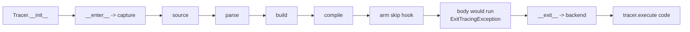

# Tracing Pipeline

## What this covers

The pipeline that turns user code inside a `with model.trace(...): ...` block into
a code object the interleaver can run in a greenlet worker. The base `Tracer`
(`src/nnsight/tracing/tracer.py:214`) is model-agnostic — it imports no torch — and
does five small steps, each overridable by a subclass:

1. **Capture** — find the calling frame and its source.
2. **Parse** — locate the `with` node at the trace line.
3. **Build** — wrap the block *body* in a compilable module.
4. **Compile** — compile the body to a code object.
5. **Execute** — run the code object and push results back into the caller's frame.

## Architecture

### The five steps


```mermaid
flowchart LR
  A[Tracer.__init__] --> B[__enter__ -> capture]
  B --> C[source]
  C --> D[parse]
  D --> E[build]
  E --> F[compile]
  F --> G[arm skip hook]
  G --> H[body would run
ExitTracingException]
  H --> I[__exit__ -> backend]
  I --> J[tracer.execute code]
```

Capture happens on `__enter__` (`tracer.py:343`). The tracer object is constructed
earlier when the user wrote `model.trace(...)`, but nothing is read until the
`with` actually enters. `capture()` is idempotent, so callers that want to sniff
whether a `with` block exists can call it early and again on entry — this is how
`traceable` (`envoy.py:69`) distinguishes `with envoy.method(...):` from a plain
`envoy.method(...)` call.

### Tracer.Info

`Tracer.Info` (`tracer.py:223`) is tiny — just what `execute` needs:

- `frame: FrameType` — the caller's live frame (its globals/locals, and its
  `co_filename`/lineno/name for tracebacks).
- `code: CodeType` — the compiled block body.

On serialization (`Info.__getstate__`) the live frame is replaced by a
`SerializedFrame` (`src/nnsight/tracing/util.py:82`) that keeps only the code
metadata; the real code object and captured scope are rebuilt on the remote side
from the source-reduced interventions payload (see
`docs/developing/serialization.md`). There is no `cache_key`, `source` list, or
`node` on `Info` — the AST node lives on the tracer (`tracer.node`) and the
per-site cache is separate (below).

### The per-site cache

`capture()` builds a key from the calling frame and memoizes the parse+compile:

```python
key = (code.co_filename, frame.f_lineno, code.co_name, code.co_firstlineno)
if key not in BLOCKS:
    source = self.source(code.co_filename)
    node = self.parse(source, frame.f_lineno)
    compiled = None if node is None else self.compile(self.build(node), frame)
    BLOCKS[key] = (node, compiled)
```

(`tracer.py:296`-`302`.) `BLOCKS` (`src/nnsight/tracing/globals.py:31`) maps the
site key to `(node, code)`. A `with model.trace(...)` inside a Python loop is read,
parsed, and compiled exactly once. A site that turns out **not** to be a `with`
block caches `(None, None)`, so the negative verdict isn't re-derived every call —
`capture` raises `WithBlockNotFoundError` (`tracer.py:51`) on that case.

`SOURCES` (`globals.py:22`) caches raw file text keyed by filename. Neither cache
is evicted or re-validated against on-disk changes — a file edited mid-run is
traced as it was first seen. Both are process-wide.

There is no per-tracer-type code cache: the same site under two tracer types
would collide on the key, but in practice a given `with` line is only ever entered
under one tracer type, and a compiled *body* is tracer-type-independent (the
subclass differences are all in `execute`, not in the compiled code). Compare this
to the OLD design, which keyed a second code cache by `(cache_key, tracer_type)`;
that layer is gone.

### Finding the caller's frame

`capture()` looks two frames up: `sys._getframe(2)` (`tracer.py:287`), i.e. past
`__enter__` to the user's frame. This replaces the OLD `get_entered_frame` /
`get_non_nnsight_frame` stack-walking heuristics. Subclasses that enter at a
different depth compensate directly: `EditingTracer.__enter__` (`editing.py:88`)
mirrors `Tracer.__enter__` inline rather than calling `super().__enter__()` so
capture sees the user's frame at the same depth.

### Source extraction

`Tracer.source(filename)` (`tracer.py:310`) returns the file text, read at most
once and cached in `SOURCES`. It handles three contexts:

1. **Files and IPython/Jupyter cells** — both come from
   `linecache.getlines(filename)`. IPython registers each cell in `linecache` under
   the frame's filename with no mtime, so the exact compiled source is available
   and line numbers line up. `checkcache` is deliberately *not* called, so a file
   saved mid-run doesn't shift line numbers under a running trace.
2. **`python -c "<code>"`** — no file on disk; the program compiles under filename
   `<string>`, so the literal source is recovered from `sys.orig_argv` (gated on
   the exact `<string>` filename).
3. Anything else with no source (e.g. a raw `exec` string, `<stdin>`) yields an
   empty string, which fails the parse and raises `WithBlockNotFoundError`.

> **Running examples:** `with model.trace(...):` reads its own source to capture
> the block, so it does **not** work from `python -c "..."`-style one-liners that
> aren't the `-c` program itself, or from a heredoc with no registered source.
> Write snippets to a `.py` file and run the file.

### Parse

`Tracer.parse(source, lineno)` (`tracer.py:350`) finds the `ast.With` /
`ast.AsyncWith` node that starts on `lineno`. It first tries `_parse_block`
(`tracer.py:369`), which slices just the block out by indentation and bracket
depth, dedents it to column 0, parses that, and shifts line numbers back. Getting
the slice bound wrong is safe: too much just parses trailing statements (the
`with` is still `body[0]`); too little makes the slice unparseable and falls back
to parsing the whole file. `parse` returns `None` if there's no `with` at that line
(the site isn't a trace block).

### Build + compile

`build(node)` (`tracer.py:412`) wraps the block's **body** (not the `with` line) in
an `ast.Module` and `fix_missing_locations`. `compile(module, frame)`
(`tracer.py:422`) compiles it under the original frame's filename and sets
`co_name` to the frame's, so tracebacks read as if the body ran where it was
written.

### The skip hook

If the block has real code (`skippable`, `tracer.py:112` — a body that is only
`pass`/docstring/`...` is left to run harmlessly), `__enter__` calls `skip_context`
(`tracer.py:55`). It sets a per-frame `f_trace` hook that raises
`ExitTracingException` the moment execution reaches the body's first line, and sets
a no-op global `sys.settrace` so Python actually delivers per-frame events.

Two constraints fall out of this line-based mechanism:

- The body must start on its own line. A body written on the `with` line would run
  where it stands and again through the backend, so `skip_context` raises a
  `ValueError` refusing it.
- A multi-line `with` header (arguments over several lines) is tolerated: the hook
  stays armed while `frame.f_lineno < body_lineno` and only fires at the body, so
  the `as` target still binds before the block is skipped.

### Execute (varies by tracer type)

`Tracer.execute(code)` (`tracer.py:431`, the base) runs the block against a `Scope`
built from the caller's locals, then `push_result` writes results back:

```python
scope = Scope(dict(frame.f_locals), frame.f_locals, frame.f_globals)
exec(code, scope)
push_result(frame, scope)
```

Subclasses override `execute` to change *how* the block runs:

- **`InterleavingTracer.execute`** (`src/nnsight/intervention/tracer.py:223`) —
  builds a `Batcher`, makes the worker(s), and hands them to `Envoy.interleave` to
  run alongside the model's forward. Two shapes: direct input (`trace(x)` → one
  implicit invoke over the whole block) vs invoke mode (`trace()` → the body is run
  now to collect `tracer.invoke(...)` sub-blocks, each a worker scoped to its rows).
- **`ScanningTracer.execute`** (`tracer.py:317`) — defers to
  `InterleavingTracer.execute` inside a `FakeTensorMode`, so the forward propagates
  only shapes/dtypes and needs no real weights.
- **`Invoker.execute`** (`tracer.py:352`) — registers its input as a batch group
  and its body as a worker on the parent tracer's interleaver; the parent runs them.
- **`EditingTracer.execute`** (`editing.py:115`) — stores the block as a
  `Mediator` on `envoy._edits` (with `copy=True`) instead of running it; the edit
  is replayed on every later trace.
- **`Iterations.execute`** (`iterator.py:135`) — the deprecated
  `with tracer.iter[...]:` form; re-runs the block once per pinned occurrence. The
  `for step in tracer.iter[...]:` form is a plain loop and does not go through
  `execute` at all.

### Scope: how a captured block reaches names

`Scope` (`src/nnsight/tracing/util.py:32`) is the namespace a captured block runs
in. Because the block runs later than the line it was written on — and, once
interleaving, in a greenlet — the names it reaches come from three places, in
order:

1. **A snapshot** of the frame's locals taken at capture (so a `for prompt in
   prompts:` variable means what it meant *where the block was written*).
2. `shared` — the live locals of the frame the block was written in, so a name
   bound by a *sibling* block (an earlier `tracer.invoke(...)`) is visible.
3. `glbls` — the frame's globals, by fallback via `__missing__`.

`Scope` is passed as `exec`'s *globals* (not just locals), so a `lambda` or nested
`def` inside the block reaches the block's own names (their free variables compile
to `LOAD_GLOBAL`, which honors `__missing__` on a dict subclass). Writes land in
the scope *and* in `shared`, so a block sees its own assignments and so do the
blocks written beside it.

### push_result and saving

`push_result(frame, variables)` (`tracer.py:201`) writes a block's variables back
into the caller's frame. `save` (`tracer.py:161`, exposed as `nnsight.save` and
behind `.save()`) marks a value by identity in a per-thread set; the **outermost**
trace filters `push_result` to only the marked values, while a nested trace pushes
everything up to its enclosing block. Depth is tracked around the backend call in
`__exit__` (`inc()`/`dec()`, `tracer.py:183`/`193`).

`save()` **raises** if called with no trace running (`tracer.py:174`):

```text
save() was called outside a trace. `.save()` / nnsight.save(x) marks a value to
return from the enclosing `with model.trace(...):` block, so it only works inside
one — move the save into the trace block.
```

`mark(value)` (`tracer.py:150`) is the same marking without the guard, for internal
callers that record return values outside a running trace (e.g. a remote backend
recording a finished request's saves).

### Frame write-back (push)

`push(frame, variables)` (`src/nnsight/tracing/util.py:150`) copies results back
into the live frame. On Python < 3.13 it calls the C-API `PyFrame_LocalsToFast` to
flush the change through the fast-locals array; from 3.13 on `f_locals` is a live
write-through mapping (PEP 667) and a plain `update` suffices.

## Key files / classes

- `src/nnsight/tracing/tracer.py:214` — `Tracer`. Capture/parse/build/compile/execute.
- `src/nnsight/tracing/tracer.py:223` — `Tracer.Info`. Frame + compiled code.
- `src/nnsight/tracing/tracer.py:270` — `Tracer.capture`. Source lookup + per-site cache.
- `src/nnsight/tracing/tracer.py:310` — `Tracer.source`. File / IPython / `-c` text.
- `src/nnsight/tracing/tracer.py:350` — `Tracer.parse`. Find the `with` node.
- `src/nnsight/tracing/tracer.py:55` — `skip_context`. The `f_trace` skip hook.
- `src/nnsight/tracing/tracer.py:161` — `save`; `:150` — `mark`; `:201` — `push_result`.
- `src/nnsight/tracing/util.py:32` — `Scope`.
- `src/nnsight/tracing/globals.py:22` — `SOURCES`; `:31` — `BLOCKS`.
- `src/nnsight/tracing/backend.py:9` — `Backend`.
- `src/nnsight/intervention/tracer.py:48` — `InterleavingTracer`; `:299` — `ScanningTracer`; `:336` — `Invoker`.
- `src/nnsight/intervention/iterator.py:39` — `Iterations`.
- `src/nnsight/intervention/editing.py:48` — `EditingTracer`.

## Lifecycle / sequence

For `with model.trace("hi") as tracer: hidden = model.layer.output.save()`:

1. `Envoy.trace("hi")` → `InterleavingTracer(self, "__call__", "hi")` — args stored.
2. `with` enters → `__enter__` → `capture()`: `sys._getframe(2)` is the user frame;
   `source` reads its file; `parse` finds the `with`; `build`+`compile` produce the
   body code; `BLOCKS[key] = (node, code)`. Since the body has real code,
   `skip_context` arms the `f_trace` hook.
3. Python reaches `hidden = ...`; the hook raises `ExitTracingException`.
4. `__exit__` swallows it, `inc()`, calls `self.backend(self)` → base `Backend`
   → `tracer.execute(tracer.info.code)`.
5. `InterleavingTracer.execute`: builds the `Batcher`; `_batch_size("hi")` > 0,
   so one `Mediator` runs the whole block; `Envoy.interleave` runs the forward.
6. The worker parks on `model.layer.output.i0`; the module's controller calls
   `handle`, serving the value; the worker `.save()`s it and finishes.
7. `push_result(frame, mediator.lcls)` writes back; `__exit__`'s outermost `dec()`
   filters to `.save()`-ed names. `hidden` is now in the caller's frame.

## Extension points

- **A new tracer type.** Subclass `Tracer`/`InterleavingTracer` and override
  `execute()`. Override `build`/`compile` only if you need a different wrapping of
  the body (rare — nnsight's subclasses all leave the body compilation alone).
- **A new backend.** Subclass `Backend`; the captured `tracer.info.code` is already
  compiled. See `docs/developing/adding-a-new-backend.md`.
- **Source capture for a new context.** Add a branch in `Tracer.source` that
  produces text for a new filename shape (e.g. a hosted-notebook cell store).

## Related

- `docs/developing/architecture-overview.md` — where the tracer sits.
- `docs/developing/interleaver-internals.md` — what `execute` hands off to.
- `docs/developing/backends.md` — how `execute` is chosen/replaced.
- `docs/developing/serialization.md` — how `Info` and the block survive remote transmission.
- `docs/concepts/deferred-execution.md` — the mental-model version.
