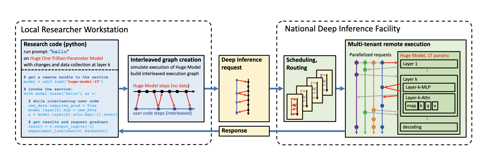
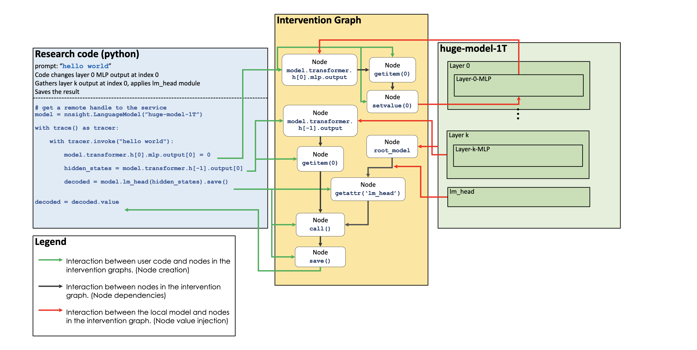

.. raw:: html

    

    

About NNsight
=============

An API for transparent science on black-box AI.
-----------------------------------------------

.. card:: How can you study the internals of a deep network that is too large for you to run?

    In this era of large-scale deep learning, the most interesting AI models are massive black boxes
    that are hard to run. Ordinary commercial inference service APIs let you interact with huge
    models, but they do not let you see model internals.

    The NNsight library is different: it gives you full access to all the neural network internals.
    When used together with a remote service like the `National Deep Inference Fabric <https://ndif.us/>`_ (NDIF),
    it lets you run experiments on huge open models easily, with full transparent access. 
    NNsight is also terrific for studying smaller local models.

.. card::
    
    An overview of the NNsight/NDIF pipeline. Researchers write simple Python code to run along with the neural network locally or remotely. Unlike commercial inference, the experiment code can read or write any of the internal states of the neural networks being studied.  This code creates a computation graph that can be sent to the remote service and interleaved with the execution of the neural network.

How do I use NNsight?
---------------------

NNsight is built on PyTorch.

Running inference on a huge remote model with NNsight is very similar to running a neural network locally on your own workstation.  In fact, with NNsight, the same code for running experiments locally on small models can also be used on large models just by changing a few arguments.

The difference between NNsight and normal inference is that when you use NNsight, you do not treat the model as an opaque black box.
Instead, you set up a Python ``with`` context that enables you to get direct access to model internals while the neural network runs.
Here is how it looks:

.. code-block:: python
    :linenos:

    from nnsight import LanguageModel
    model = LanguageModel('meta-llama/Meta-Llama-3.1-70B')
    with model.trace('The Eiffel Tower is in the city of ', remote=True):
        hidden_state = model.layers[10].input[0].save()  # save one hidden state
        model.layers[11].mlp.output = 0  # change one MLP module output
        output = model.output.save() # save model output
    print('The model predicts', output)
    print('The internal state was', hidden_state)

The library is easy to use. Any HuggingFace language model can be loaded into a ``LanguageModel`` object, as you can see on line 2.  
Notice we are loading a 70-billion parameter model, which is ordinarily pretty difficult to load on a regular workstation since it would take 140-280 gigabytes of GPU RAM just to store the parameters. 

The trick that lets us work with this huge model is on line 3.  We set the flag ``remote=True`` to indicate that we want to actually run the network on the remote service. 
By default the remote service will be NDIF.  If we want to just run a smaller model locally on our machine, we could leave it as ``remote=False``.

Then when we trace and invoke the model on line 3, we do not just call it as a function. Instead, we access it using a ``with`` context manager. 
This allows NNsight to open up black box neural network models, providing direct access to model internals.

You can see what simple direct access looks like on lines 4-6. 
On line 4, we grab a hidden state at layer 10, and on line 5, we change the output of an MLP module inside the transformer at layer 11.

When you run this ``with``-block code on lines 3 through 6 on your local workstation, it creates a computation graph storing all your requested calculations on the model.  
When the ``with`` block is completed, all the defined calculations are sent to the remote server and executed there. 
Then when model execution is completed, saved results can be accessed on your local workstation, as shown on line 7 and 8.

What happens behind the scenes?
-------------------------------
When using NNsight, it is helpful to understand that the operations are not executed immediately but instead adds to an intervention graph that is executed alongside the model's computation graph upon exit of the with block.

An example of one such intervention graph can be seen below:

.. card::
    
    An example of an intervention graph. Operations in research code create nodes in the graph which depend on module inputs and outputs as well as other nodes. Then, this intervention graph is interleaved with the normal computation graph of the chosen model, and requested inputs and outputs are injected into the intervention graph for execution. 

Basic access to model internals can give you a lot of insight about what is going on inside a large model as it runs.  For example, you can use the `logit lens <https://www.lesswrong.com/posts/AcKRB8wDpdaN6v6ru/interpreting-gpt-the-logit-lens>`_ to read internal hidden states as text.  
And use can use `causal tracing <https://rome.baulab.info/>`_ or `path patching <https://arxiv.org/abs/2304.05969>`_ or `other circuit discovery methods <https://arxiv.org/abs/2310.10348>`_ to locate the layers and components within the network that play a decisive role in making a decision.

And with NNsight, you can use these methods on large models like Llama-3.1-70b or Llama-3.1-405b.

The NNsight library also provides full access to gradients and optimization methods, out of order module applications, cross prompt interventions, and many more features.

See the :doc:`start` and :doc:`features` pages for more information on NNsight's functionality.

Join the `NDIF Discord <https://discord.gg/6uFJmCSwW7>`_ for updates, feature requests, bug reports, and opportunities to help with our efforts. 
If you'd like to report an issue or give our project a star, check out our GitHub: https://github.com/ndif-team/nnsight.
