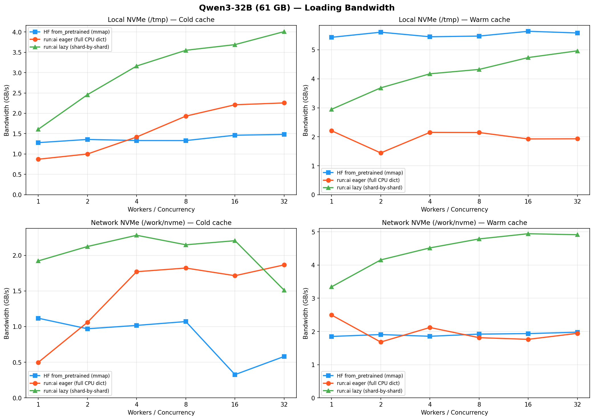
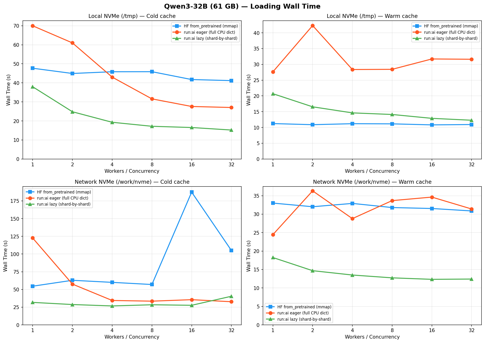
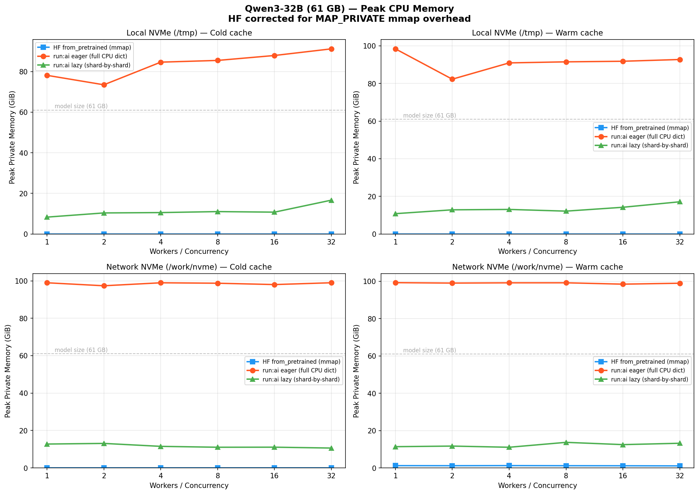

# Model Loading Benchmark: HF vs run:ai Streamer

## Benchmark Environment

All benchmarks run on NCSA Delta with **Qwen/Qwen3-32B** (61 GB, bfloat16, 17 safetensors shards) on 2x NVIDIA A40 GPUs.

| Setting | Local NVMe (`/tmp`) | Network NVMe (`/work/nvme`) |
|---------|--------------------|-----------------------------|
| **Storage** | 1 TB NVMe SSD on compute node | Lustre parallel filesystem over Slingshot |
| **Filesystem** | XFS on LVM | Lustre (`@tcp10` over `hsn0`) |
| **Cold cache** | `posix_fadvise(FADV_DONTNEED)` evicts page cache before each run | Same (partial effectiveness on Lustre client cache) |
| **Warm cache** | Model shards read into page cache before timing | Same |

Each experiment sweeps worker/concurrency counts from 1 to 32. CPU memory is measured via a background thread polling `/proc/self/smaps_rollup` every 100ms.

## Why HuggingFace Loading Is Slow

HuggingFace `from_pretrained` with `device_map="auto"` reads weights via **safetensors mmap**. Loading is I/O-bound — CPU processing and GPU transfer are fast enough to hide behind I/O — so the only thing that matters is how efficiently we read from storage.

mmap's problem is its I/O granularity. Each demand-paged read triggers a **4 KB page fault**. On local NVMe the kernel services these quickly, but on a network filesystem like Lustre each fault becomes a separate RPC with full round-trip overhead. For a 61 GB model that's ~16M page faults. The per-message cost dominates, and the kernel's readahead window (~128-512 KB) can't compensate — it's conservative and resets when concurrent threads disrupt sequential access patterns.

Adding HF workers doesn't help: `dot_natural_key` sorts tensors by layer name, which correlates with shard file order, so all workers fault into the same pages of the same shard. The readahead buffer is shared, and extra threads just contend rather than increasing parallelism.

The result: **~1.1-1.5 GB/s** on local NVMe (vs ~4-5 GB/s hardware capability), degrading to **0.3-0.6 GB/s** on Lustre at high worker counts.

## Our Solution: run:ai Shard-by-Shard Streaming

We replace mmap with [run:ai model streamer](https://github.com/run-ai/runai-model-streamer)'s explicit `read()` syscalls — large, sequential, issued by N concurrent C++ pthreads (no GIL). This is the core optimization: **fewer, bigger I/O operations** instead of millions of 4 KB page faults.

We offer two modes:

### Eager mode (`load_format="runai_eager"`)

Streams all shards into a CPU dict first, then passes to `from_pretrained(None, state_dict=...)` for device placement. Fast (~2.2 GB/s at concurrency=32) but uses **~80-95 GiB peak CPU memory**.

### Lazy mode (default, `load_format=None`)

A `LazyRunAITensor` acts as a drop-in replacement for safetensors slices inside HF's loading pipeline. On first access to a tensor, `RunAIShardCache` streams the **entire shard** via run:ai, caches all its tensors, and serves subsequent requests from the same shard instantly. Shards are evicted once all their keys are consumed, keeping only 2-3 shards in memory at a time.

Since loading is I/O-bound, the brief cache-hit + `.to(device)` drain between shards is negligible compared to the streaming time — the storage stays saturated.

## Results

### Loading Bandwidth



**Cold cache (left):** run:ai lazy reaches **4 GB/s** on local NVMe (concurrency=32), ~3x faster than HF's ~1.3 GB/s ceiling. On network storage, lazy achieves **2.2 GB/s** vs HF's ~1 GB/s (which degrades to 0.3 GB/s at high worker counts).

**Warm cache (right):** HF benefits most from warm cache on local NVMe (~5.5 GB/s) since mmap's zero-copy avoids the `read()` memcpy overhead. run:ai lazy still achieves **~5 GB/s**, competitive with HF.

### Loading Wall Time



Lazy loading achieves **15-17s** cold and **12-13s** warm on local NVMe for a 61 GB model, vs HF's **41-48s** cold and **11s** warm.

### Peak CPU Memory



| Method | Peak CPU Memory | Notes |
|--------|----------------|-------|
| **HF** | ~3 GiB | mmap avoids bulk allocation; tensors demand-paged |
| **run:ai eager** | ~80-95 GiB | Full model in numpy buffer before GPU placement |
| **run:ai lazy** | ~10-17 GiB | Only 2-3 shards cached at a time |

Lazy loading is the best trade-off: **3-4x faster than HF with only ~3x its memory footprint**, and **5-8x less memory than eager** with comparable or better speed.

## Running the Benchmark

```bash
# Cold cache, all three methods
python benchmark_loading.py --model Qwen/Qwen3-32B --no-verify

# Warm cache
python benchmark_loading.py --model Qwen/Qwen3-32B --warmup --no-drop-caches --no-verify

# Specific methods only
python benchmark_loading.py --model Qwen/Qwen3-32B --experiments hf runai_lazy

# Generate plots
python plot_results.py
```
