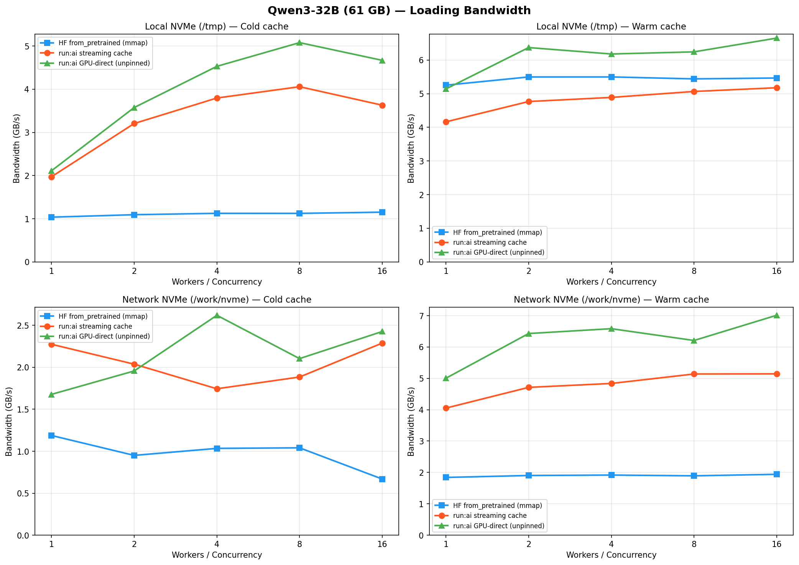
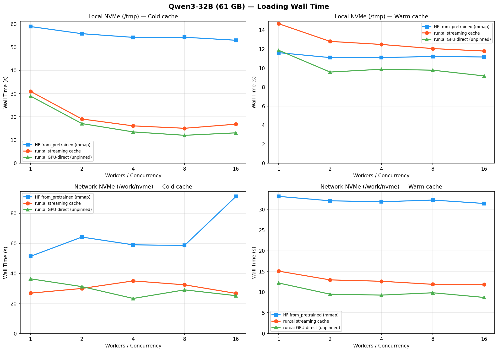
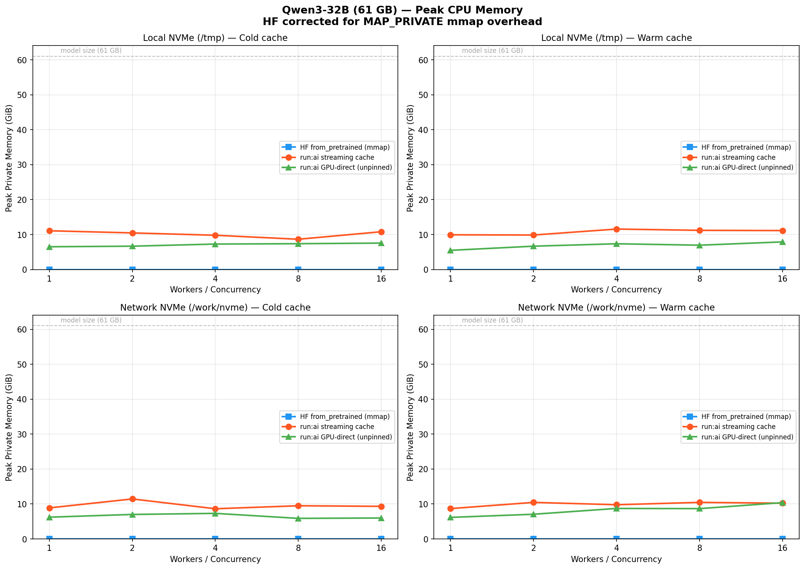

# Run:AI Model Loading with GPU-Direct Tensor Placement

Fast model loading for nnsight's `LanguageModel` via [run:ai model streamer](https://github.com/run-ai/runai-model-streamer) with direct buffer-to-GPU tensor placement, bypassing CPU intermediaries.

## Why HuggingFace Loading Is Slow

HuggingFace `from_pretrained` with `device_map="auto"` has two bottlenecks:

**1. Disk reads via mmap (4 KB page faults).** Safetensors files are memory-mapped. Each tensor access triggers demand-paged reads at 4 KB granularity. The kernel's readahead (~128-512 KB) helps for sequential access, but HF's multi-threaded workers disrupt sequentiality and contend for the same pages. Result: ~1.5 GB/s on local NVMe vs ~5-10 GB/s hardware capability.

**2. Synchronous CPU→GPU copies.** Each HF worker thread calls `_materialize_copy(tensor, device).to(device)`, which triggers `cudaMemcpyAsync`. Despite the name, this blocks the calling CPU thread until the DMA transfer completes (source memory isn't pinned). For a 65 GB model, 4 worker threads accumulate **~148s of blocked CPU time** across all transfers — this is what dominates the ~43s wall time.

Profiling on Qwen3-32B (A100-80GB, 8×NVMe RAID-0) shows the breakdown:

```
HF from_pretrained:  42.89s wall
  cudaMemcpyAsync:   147.93s cumulative CPU time (4 workers blocked on GPU DMA)
  Disk:              1.42 GB/s avg, 98% utilization (steady but throttled by mmap)
```

The disk is busy the entire time but reads slowly. Workers spend most of their time blocked on GPU transfers, not doing useful work.

## Our Solution

We replace mmap with run:ai's explicit large sequential `read()` syscalls and add GPU-direct tensor placement. The loading pipeline has evolved through two stages:

### Stage 1: Run:AI Streaming with CPU Cache

Replace mmap with run:ai's `SafetensorsStreamer` — large sequential `read()` syscalls issued by N concurrent C++ pthreads (no GIL contention). Tensors are cloned to a CPU cache as they arrive, then HF workers pick them up and call `.to(device)` for GPU placement.

This solves the disk I/O bottleneck (bursts at 6-10 GB/s) but the CPU→GPU copy remains: HF workers still block on `cudaMemcpyAsync` for 52s cumulative. The disk sits idle 61% of the time waiting for workers to finish GPU transfers.

### Stage 2: GPU-Direct Tensor Placement (Current)

The key insight: HF's `_materialize_copy` calls `tensor[...]` (our `__getitem__`) then `.to(device, dtype)`. If `__getitem__` returns a tensor **already on the target device with the correct dtype**, then `.to()` is a no-op (~0.02ms).

We resolve `device_map` before building the lazy state dict, so the streaming cache knows each tensor's target GPU at read time. The loader thread copies tensors directly from the run:ai buffer to GPU via `.to(device=cuda:N, dtype=dtype)`. HF workers just consume pre-placed tensors.

```
Stage 1 (CPU cache):     disk → Run:AI buffer → clone() → CPU cache → HF .to(cuda) → GPU
Stage 2 (GPU-direct):    disk → Run:AI buffer → .to(cuda) → GPU cache → HF .to() [no-op]
```

This eliminates both the CPU clone and the HF worker's GPU transfer:

```
GPU-direct:          17.52s wall
  cudaMemcpyAsync:   8.17s cumulative CPU time (down from 148s)
  Disk:              3.48 GB/s avg, 63% utilization (up from 39%)
```

## Architecture

```
┌─────────────────────────────────────────────────────────────┐
│ TransformersModel._load_streamed()                          │
│                                                             │
│  1. resolve_shard_paths()     → list of .safetensors paths  │
│  2. _resolve_device_map()    → {"model.layers.0": 0, ...}  │
│  3. build_lazy_state_dict()  → {key: LazyRunAITensor, ...}  │
│  4. from_pretrained(None, state_dict=...)                   │
└─────────────────────────────────────────────────────────────┘

┌─────────────────────────────────────────────────────────────┐
│ RunAIShardCache (loader thread)                             │
│                                                             │
│  SafetensorsStreamer.get_tensors() yields (name, buffer)    │
│    ├─ GPU target? → tensor.to(device=cuda:N, dtype=dtype)  │
│    └─ CPU target? → tensor.clone()                         │
│  Store in _tensors[name], notify_all() waiting workers     │
└─────────────────────────────────────────────────────────────┘

┌─────────────────────────────────────────────────────────────┐
│ HF GLOBAL_WORKERS threads                                   │
│                                                             │
│  _materialize_copy(lazy_tensor, device, dtype)              │
│    → lazy_tensor[...]  → cache.get() → returns GPU tensor  │
│    → tensor.to(device, dtype)  → no-op (already there)     │
└─────────────────────────────────────────────────────────────┘
```

### Key Files

| File | Role |
|---|---|
| `src/nnsight/modeling/loader.py` | `RunAIShardCache`, `LazyRunAITensor`, `build_lazy_state_dict` |
| `src/nnsight/modeling/transformers.py` | `_load_streamed`, `_resolve_device_map`, `gpu_direct` flag |

### User-Facing API

```python
from nnsight import LanguageModel

# GPU-direct (default when run:ai is installed)
model = LanguageModel("Qwen/Qwen3-8B", device_map="auto", dispatch=True)

# Force HF from_pretrained
model = LanguageModel("Qwen/Qwen3-8B", device_map="auto", dispatch=True,
                      load_format="from_pretrained")

# CPU-clone path (for benchmarking comparison)
model = LanguageModel("Qwen/Qwen3-8B", device_map="auto", dispatch=True,
                      gpu_direct=False)

# Tune Run:AI I/O concurrency (default 16)
model = LanguageModel("Qwen/Qwen3-8B", device_map="auto", dispatch=True,
                      concurrency=32)
```

If `runai-model-streamer` is not installed, loading falls back to `from_pretrained` silently.

## Benchmark Results

### Qwen3-32B (65.5 GB, bfloat16) — A100-80GB, 8×NVMe RAID-0, cold cache

| Method | Wall Time | Effective BW | Speedup |
|---|---|---|---|
| HF `from_pretrained` | 40.36s | 1.62 GB/s | 1.0x |
| Run:AI stream (CPU clone) | 25.74s | 2.54 GB/s | 1.6x |
| **Run:AI GPU-direct** | **17.18s** | **3.81 GB/s** | **2.3x** |

### Qwen3-8B (16.4 GB) — same setup

| Method | Wall Time | Effective BW | Speedup |
|---|---|---|---|
| HF `from_pretrained` | 12.05s | 1.37 GB/s | 1.0x |
| Run:AI stream (CPU clone) | 7.42s | 2.21 GB/s | 1.6x |
| **Run:AI GPU-direct** | **5.67s** | **2.89 GB/s** | **2.1x** |

### Qwen3-30B-A3B (MoE, 56.9 GB) on A100-80GB, 8×NVMe RAID-0, cold cache

| Method | Wall Time | Effective BW | Speedup |
|---|---|---|---|
| HF `from_pretrained` | 44.12s | 1.29 GB/s | 1.0x |
| Run:AI stream (CPU clone) | 29.34s | 1.94 GB/s | 1.5x |
| **Run:AI GPU-direct** | **23.29s** | **2.44 GB/s** | **1.9x** |

Weight verification: PASS — all 531 parameters match exactly across all three loading paths. MoE expert weights, router gates, and standard layers all loaded correctly.

Logits match exactly across all three methods.

### Profiling Breakdown (Qwen3-32B)

| | HF | Stream (CPU) | GPU-direct |
|---|---|---|---|
| `cudaMemcpyAsync` CPU time | 147.93s | 51.76s | **8.17s** |
| Disk avg BW | 1.42 GB/s | 2.24 GB/s | **3.48 GB/s** |
| Disk utilization | 98% | 39% | **63%** |
| Disk idle time | 0.9s | 16.0s | **6.1s** |

HF keeps the disk busy but reads slowly (mmap). Run:AI stream bursts at 10 GB/s but the disk idles 61% of the time waiting for CPU→GPU copies. GPU-direct cuts idle time to 37% by doing GPU transfers in the loader thread.

## Results (On Delta)

### Loading Bandwidth



**Cold cache (left column):** run:ai GPU-direct reaches **~5 GB/s** on local NVMe (concurrency=8), ~4.4x faster than HF's ~1.1 GB/s ceiling. run:ai streaming cache reaches ~4 GB/s. On network storage, GPU-direct achieves **~2.6 GB/s** vs HF's ~1.2 GB/s (which degrades to ~0.7 GB/s at high worker counts).

**Warm cache (right column):** On local NVMe, run:ai GPU-direct achieves **~6.6 GB/s**, outperforming even HF's warm-cache mmap path (~5.5 GB/s). run:ai streaming cache reaches ~5.2 GB/s, competitive with HF. On network NVMe, GPU-direct achieves **~7 GB/s** warm vs HF's ~1.9 GB/s — the gap widens because mmap benefits less from warm cache on networked storage.

### Loading Wall Time



GPU-direct loading achieves **12s** cold and **~9s** warm on local NVMe for a 61 GB model, vs HF's **53s** cold and **~11s** warm. Streaming cache achieves **15s** cold and **~12s** warm.

### Peak CPU Memory



The memory advantage of run:ai loading is significant:

| Method | Peak CPU Memory | Notes |
| :---- | :---- | :---- |
| **HF** | <1 GiB | mmap avoids bulk allocation; tensors demand-paged |
| **run:ai streaming cache** | ~9–11 GiB | Tensors cloned to CPU cache as they stream |
| **run:ai GPU-direct** | ~7–8 GiB | Tensors placed directly on GPU; less CPU buffering needed |

GPU-direct loading is the best trade-off: **~4.4x faster than HF with modest CPU memory (~7–8 GiB)**, while using less memory than the streaming cache path and achieving higher throughput.

## Running Benchmarks

```bash
# Quick comparison (2 configs each, uses CUDA_VISIBLE_DEVICES GPU)
CUDA_VISIBLE_DEVICES=0 python benchmark_loading.py \
  --model Qwen/Qwen3-8B --gpus 0 \
  --experiments hf runai_stream runai_gpu_direct --no-verify

# Full sweep (6 concurrency/worker configs × N repeats)
python benchmark_loading.py --model Qwen/Qwen3-32B --repeats 3

# Disk I/O timeline
CUDA_VISIBLE_DEVICES=0 python profile_io_timeline.py \
  --model Qwen/Qwen3-8B --experiment runai_gpu_direct --disk-device md0

# Full profiler (torch.profiler + iostat + cache stats)
CUDA_VISIBLE_DEVICES=0 python profile_loading.py \
  --model Qwen/Qwen3-8B --experiment runai_gpu_direct --disk-device md0
```

See [PROFILING.md](PROFILING.md) for detailed profiling methodology and how to interpret results.
